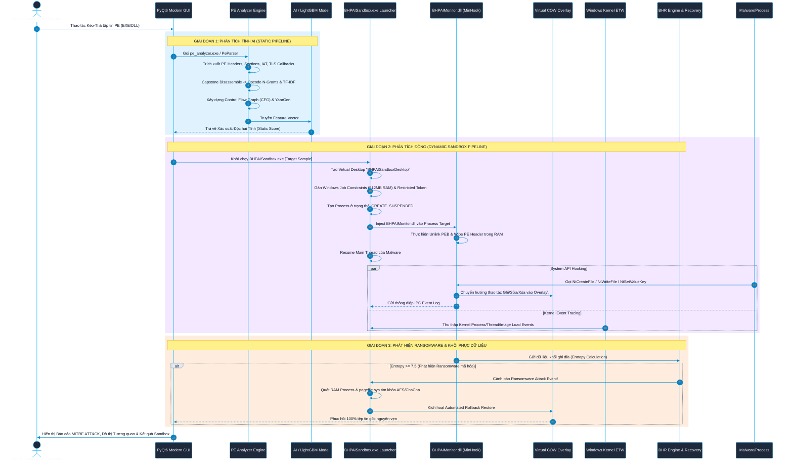
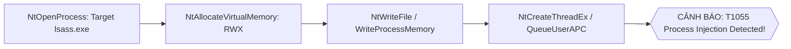

# TÀI LIỆU DỰ ÁN TOÀN DIỆN: BHPAI
> **Phiên bản hệ thống**: V1.5 Enterprise Edition  
> **Tác giả**: Bao
> **Ngôn ngữ phát triển**: C++17 (MinGW-w64 / MSYS2), Python 3.9+, PyQt6, FastAPI, MinHook, Capstone Engine, PyTorch, LightGBM  
> **Tài liệu tham chiếu master**: Chi tiết kiến trúc, giải thuật, cấu trúc mã nguồn, quy trình bảo mật và hướng dẫn vận hành toàn bộ hệ thống BHPAI.

---

## MỤC LỤC TỔNG QUAN

1. [TỔNG QUAN DỰ ÁN & TẦM NHÌN KIẾN TRÚC](#1-tổng-quan-dự-án--tầm-nhìn-kiến-trúc)
   - [1.1 Bối cảnh bảo mật & Bài toán đặt ra](#11-bối-cảnh-bảo-mật--bài-toán-đặt-ra)
   - [1.2 Triết lý thiết kế Hybrid (Phân tích tĩnh + Phân tích động + AI/ML)](#12-triết-lý-thiết-kế-hybrid-phần-tích-tĩnh--phân-tích-động--aiml)
   - [1.3 Các chỉ số kỹ thuật chính (Technical Highlights)](#13-các-chỉ-số-kỹ-thuật-chính-technical-highlights)
2. [SƠ ĐỒ KIẾN TRÚC & LUỒNG XỬ LÝ DỮ LIỆU TỔNG THỂ](#2-sơ-đồ-kiến-trúc--luồng-xử-lý-dữ-liệu-tổng-thể)
3. [CHI TIẾT PHÂN HỆ 1: DYNAMIC WINDOWS SANDBOX & STEALTH MONITORING](#3-chi-tiết-phân-hệ-1-dynamic-windows-sandbox--stealth-monitoring)
   - [3.1 Môi trường ảo hóa Desktop & Giới hạn Job Object Constraints](#31-môi-trường-ảo-hóa-desktop--giới-hạn-job-object-constraints)
   - [3.2 Tước bỏ đặc quyền bằng Restricted Token](#32-tước-bỏ-đặc-quyền-bằng-restricted-token)
   - [3.3 Kỹ thuật Anti-Evasion & Stealth (PEB Unlinking & RAM Header Wiping)](#33-kỹ-thuật-anti-evasion--stealth-peb-unlinking--ram-header-wiping)
   - [3.4 Can thiệp Native API (MinHook Engine & System Hooks)](#34-can-thiệp-native-api-minhook-engine--system-hooks)
   - [3.5 Công nghệ Copy-On-Write (COW) Overlay cho Filesystem & Registry](#35-công-nghệ-copy-on-write-cow-overlay-cho-filesystem--registry)
   - [3.6 Kernel Event Tracing (ETW Monitor)](#36-kernel-event-tracing-etw-monitor)
   - [3.7 Fake Network Server (C2 Sinkhole & Payload Mocking)](#37-fake-network-server-c2-sinkhole--payload-mocking)
4. [CHI TIẾT PHÂN HỆ 2: STATIC PE ANALYZER & CAPSTONE DISASSEMBLER](#4-chi-tiết-phân-hệ-2-static-pe-analyzer--capstone-disassembler)
   - [4.1 Phân tích cấu trúc PE, Entropy Sections & Dị thường (Anomalies)](#41-phân-tích-cấu-trúc-pe-entropy-sections--dị-thường-anomalies)
   - [4.2 Giải mã Opcode N-Grams & Trọng số TF-IDF](#42-giải-mã-opcode-n-grams--trọng-số-tf-idf)
   - [4.3 Chuỗi gọi API N-Grams & Đồ thị dòng điều khiển (CFG)](#43-chuỗi-gọi-api-n-grams--đồ-thị-dòng-điều-khiển-cfg)
   - [4.4 Bộ nhận diện & Giải nén Packer (UPX / WWPack Unpacker)](#44-bộ-nhận-diện--giải-nén-packer-upx--wwpack-unpacker)
   - [4.5 Tự động sinh luật YARA (YaraGen) & Fuzzy Hashing (SSDEEP / TLSH)](#45-tự-động-sinh-luật-yara-yaragen--fuzzy-hashing-ssdeep--tlsh)
5. [CHI TIẾT PHÂN HỆ 3: MACHINE LEARNING & AI PIPELINE](#5-chi-tiết-phân-hệ-3-machine-learning--ai-pipeline)
   - [5.1 Trích xuất & Hợp nhất đặc trưng (Feature Vectorization)](#51-trích-xuất--hợp-nhất-đặc-trưng-feature-vectorization)
   - [5.2 PyTorch API Sequence Embedder & Graph Neural Network (GNN)](#52-pytorch-api-sequence-embedder--graph-neural-network-gnn)
   - [5.3 Tối ưu hóa đặc trưng bằng SHAP Feature Pruning](#53-tối-ưu-hóa-đặc-trưng-bằng-shap-feature-pruning)
   - [5.4 Mô hình Phân loại LightGBM Ensemble & Dynamic Thresholding](#54-mô-hình-phân-loại-lightgbm-ensemble--dynamic-thresholding)
6. [CHI TIẾT PHÂN HỆ 4: BHR ENGINE (RANSOMWARE DETECTOR & RECOVERY)](#6-chi-tiết-phân-hệ-4-bhr-engine-ransomware-detector--recovery)
   - [6.1 Thuật toán phát hiện mã hóa Entropy cao (Shannon Entropy Rate)](#61-thuật-toán-phát-hiện-mã-hóa-entropy-cao-shannon-entropy-rate)
   - [6.2 Giám sát Burst Modification Rate & Hành vi xóa Shadow Copy](#62-giám-sát-burst-modification-rate--hành-vi-xóa-shadow-copy)
   - [6.3 Trích xuất khóa mã hóa từ RAM & Pagefile (`pagefile.sys`)](#63-trích-xuất-khóa-mã-hóa-từ-ram--pagefile-pagefilesys)
   - [6.4 Khôi phục dữ liệu tự động từ COW Overlay Buffer](#64-khôi-phục-dữ-liệu-tự-động-từ-cow-overlay-buffer)
   - [6.5 Nhật ký Crypto Timeline & Bản đồ biến đổi dữ liệu](#65-nhật-ký-crypto-timeline--bản-đồ-biến-đổi-dữ-liệu)
7. [CHI TIẾT PHÂN HỆ 5: BEHAVIOR CORRELATOR & MITRE ATT&CK MAPPING](#7-chi-tiết-phân-hệ-5-behavior-correlator--mitre-attck-mapping)
   - [7.1 Chuẩn hóa sự kiện đa nguồn (Userland Hooks + Kernel ETW)](#71-chuẩn-hóa-sự-kiện-đa-nguồn-userland-hooks--kernel-etw)
   - [7.2 Quy tắc tương quan chuỗi tấn công (Attack Chain Rules)](#72-quy-tắc-tương-quan-chuỗi-tấn-công-attack-chain-rules)
   - [7.3 Bản đồ ma trận kỹ thuật MITRE ATT&CK](#73-bản-đồ-ma-trận-kỹ-thuật-mitre-attck)
8. [CHI TIẾT PHÂN HỆ 6: ZERO-KNOWLEDGE ENCRYPTED BACKUP VAULT](#8-chi-tiết-phân-hệ-6-zero-knowledge-encrypted-backup-vault)
   - [8.1 Mô hình mã hóa Client-Side E2EE & Cây sinh khóa KDF/HKDF](#81-mô-hình-mã-hóa-client-side-e2ee--cây-sinh-khóa-kdfhkdf)
   - [8.2 Giao thức xác thực không tiết lộ tri thức SRP-6a PAKE (RFC 5054)](#82-giao-thức-xác-thực-không-tiết-lộ-tri-thức-srp-6a-pake-rfc-5054)
   - [8.3 Đổi mật khẩu tức thì (Instant Re-Keying Mechanism)](#83-đổi-mật-khẩu-tức-thì-instant-re-keying-mechanism)
   - [8.4 Bảo mật AAD chuẩn hóa & Bucket Size Padding chống phân tích dữ liệu](#84-bảo-mật-aad-chuẩn-hóa--bucket-size-padding-chống-phân-tích-dữ-liệu)
9. [CHI TIẾT PHÂN HỆ 7: GIAO DIỆN PYQT6 & RESTFUL API SERVER](#9-chi-tiết-phân-hệ-7-giao-diện-pyqt6--restful-api-server)
   - [7.1 Kiến trúc Giao diện PyQt6 Modern GUI (Multi-threading QThread)](#71-kiến-trúc-giao-diện-pyqt6-modern-gui-multi-threading-qthread)
   - [7.2 RESTful API Server (FastAPI Framework & Swagger Documentation)](#72-restful-api-server-fastapi-framework--swagger-documentation)
10. [HƯỚNG DẪN KHỞI CHẠY GIAO DIỆN GUI (GUI.PY)](#10-hướng-dẫn-khởi-chạy-giao-diện-gui-guipy)

---

## 1. TỔNG QUAN DỰ ÁN & TẦM NHÌN KIẾN TRÚC

### 1.1 Bối cảnh bảo mật & Bài toán đặt ra
Trong kỷ nguyên an ninh mạng hiện đại, các chủng mã độc (Malware) và mã độc đòi tiền chuộc (Ransomware) thế hệ mới đã tiến hóa vượt bậc với khả năng:
1. **Lẩn tránh phân tích tĩnh (Static Evasion)**: Sử dụng kĩ thuật đa hình (Polymorphic), biến hình (Metamorphic), nén và mã hóa custom packer làm vô hiệu hóa các giải pháp Antivirus dựa trên chữ ký (Signature-based AV).
2. **Lẩn tránh Sandbox (Anti-Sandbox / Anti-Analysis)**: Kiểm tra thông tin môi trường ảo hóa (VMware, VirtualBox, QEMU), kiểm tra sự có mặt của debugger, quét các DLL giám sát nạp trong tiến trình (Hook detection), hoặc thực hiện các hành vi ngụy trang chờ đợi (Sleep evasion).
3. **Phá hủy dữ liệu tốc độ cao (High-speed Crypto Destruction)**: Các dòng Ransomware như LockBit, BlackCat, Conti thực hiện mã hóa bất đồng bộ đa luồng (Multi-threaded I/O), xóa sạch bản sao lưu hệ thống (Volume Shadow Copies) và các kênh phục hồi trong vài giây.

**BHPAI** ra đời nhằm giải quyết triệt để các bài toán thách thức trên bằng giải pháp **toàn diện 3 lớp (Hybrid Tri-Layer Security)**: Phân tích Tĩnh AI, Phân tích Động Sandbox Cách ly Tuyệt đối, và Engine Giám sát Phục hồi Ransomware Thời gian thực.

---

### 1.2 Triết lý thiết kế Hybrid (Phân tích tĩnh + Phân tích động + AI/ML)

BHPAI được thiết kế dựa trên 4 trụ cột kiến trúc vững chắc:

```
                  ┌───────────────────────────────────────────────┐
                  │                BHPAI CORE ENGINE              │
                  └───────────────────────┬───────────────────────┘
                                          │
       ┌──────────────────────────────────┼──────────────────────────────────┐
       │                                  │                                  │
┌──────▼─────────────────┐     ┌──────────▼───────────────┐     ┌────────────▼───────────────┐
│  STATIC PE ANALYZER    │     │  DYNAMIC WINDOWS SANDBOX │     │    BHR ENGINE & RECOVERY   │
│  - Capstone Disassembly│     │  - Desktop Virtualization│     │  - High Entropy Detection  │
│  - Opcode TF-IDF       │     │  - Job Limits & Token    │     │  - Key Extractor (RAM/PAGE)│
│  - CFG Graph Extraction│     │  - COW Filesystem/Reg    │     │  - Instant Rollback Restore│
│  - YaraGen & SSDEEP    │     │  - Stealth PEB Unlink    │     │  - Crypto Timeline         │
└──────────────┬─────────┘     └──────────┬───────────────┘     └────────────┬───────────────┘
               │                          │                                  │
               └──────────────────────────┼──────────────────────────────────┘
                                          │
                               ┌──────────▼────────────────┐
                               │   AI & BEHAVIOR CORRELATOR│
                               │  - PyTorch GNN & LSTM     │
                               │  - LightGBM + SHAP        │
                               │  - MITRE ATT&CK Mapper    │
                               └───────────────────────────┘
```

1. **Safety First**: Sandbox hoạt động trong môi trường **Desktop ảo độc lập** (`BHPAISandboxDesktop`), bị giới hạn nghiêm ngặt bởi **Windows Job Object Constraints** và **Restricted Token**. Cơ chế **Copy-On-Write (COW)** đảm bảo không một byte dữ liệu nào do malware tạo/sửa/xóa có thể chạm tới hệ thống thật.
2. **Stealth Anti-Evasion (Tự ẩn giấu)**: Monitor DLL tự un-link khỏi 3 danh sách PEB Module, xóa sạch PE Header & Debug PDB trên RAM, đồng thời khôi phục DACL bảo vệ Sandbox Launcher khỏi bị malware vô hiệu hóa.
3. **Data Protection & Key Recovery (Bảo vệ & Phục hồi dữ liệu)**: BHR Engine phát hiện tức thì các dấu hiệu mã hóa entropy cao, tự động trích xuất khóa AES/ChaCha20/Salsa20 từ bộ nhớ RAM & file swap `pagefile.sys`, đồng thời phục hồi 100% tệp gốc từ vùng đệm COW Overlay.
4. **Explainable AI (Trí tuệ nhân tạo có giải thích)**: Kết hợp Opcode N-Grams, Graph Neural Network (GNN) trên Control Flow Graph (CFG) và mô hình LightGBM được tối ưu bằng **SHAP Feature Pruning** giúp đạt tỷ lệ cảnh báo nhầm (False Positive) tiệm cận 0%.

---

### 1.3 Các chỉ số kỹ thuật chính (Technical Highlights)

| Tiêu chí | Thông số Kỹ thuật & Công nghệ áp dụng |
| :--- | :--- |
| **Môi trường Sandbox** | Windows Job Object (RAM 512MB, CPU Affinity, No Breakaway) + Restricted Token |
| **Ảo hóa Filesystem/Registry** | Copy-On-Write (COW) Virtual Overlay hỗ trợ Alternate Data Streams (ADS) & Merged Registry View |
| **Kỹ thuật Stealth** | Unlink PEB (`InLoadOrder`, `InMemoryOrder`, `InInitializationOrder`) + Memory PE Header Scrubber |
| **Framework Hooking** | MinHook Engine (Intercepting Native NT APIs: `NtCreateFile`, `NtWriteFile`, `NtMapViewOfSection`,...) |
| **Kernel Monitoring** | Windows Event Tracing (ETW) Kernel Event Provider Integration |
| **Engine Phân dịch (Static)** | Capstone Disassembly Engine (x86/x64) + Opcode TF-IDF + API Call N-Grams |
| **Mô hình AI / ML** | PyTorch Sequence Embedder + Control Flow Graph GNN + LightGBM Classifier + SHAP Pruning |
| **Phát hiện Ransomware** | Real-time Shannon Entropy Calculation ($\ge 7.5$) + Burst Modification Rate ($>20$ files/s) |
| **Khôi phục dữ liệu** | Automatic COW Overlay Rollback + RAM & `pagefile.sys` Symmetric Key Pattern Extractor |
| **Sao lưu bảo mật (Vault)** | Zero-Knowledge Client E2EE (AES-256-GCM) + SRP-6a PAKE (RFC 5054) + Instant Re-Keying |

---

## 2. SƠ ĐỒ KIẾN TRÚC & LUỒNG XỬ LÝ DỮ LIỆU TỔNG THỂ

Luồng xử lý toàn diện của hệ thống từ khi nhận mẫu PE cho đến khi xuất báo cáo và khôi phục dữ liệu:



---

## 3. CHI TIẾT PHÂN HỆ 1: DYNAMIC WINDOWS SANDBOX & STEALTH MONITORING

Mã nguồn chính nằm tại: [`Core/sandbox/launcher/`](file:///c:/Users/Kryo/Music/BHPAI/Core/sandbox/launcher) & [`Core/sandbox/monitor/`](file:///c:/Users/Kryo/Music/BHPAI/Core/sandbox/monitor).

### 3.1 Môi trường ảo hóa Desktop & Giới hạn Job Object Constraints
Để ngăn chặn hoàn toàn khả năng mã độc can thiệp vào giao diện người dùng, đọc màn hình hoặc chiếm quyền điều khiển chuột/bàn phím, `ProcessController.cpp` khởi tạo một Desktop ảo lập riêng biệt:

```cpp
// Tạo Virtual Desktop hoàn toàn riêng biệt
HDESK hSandboxDesktop = CreateDesktopA(
    "BHPAISandboxDesktop",
    NULL, NULL, 0,
    GENERIC_ALL,
    NULL
);
```

Đồng thời, tiến trình độc hại và tất cả tiến trình con do nó sinh ra được đưa vào một **Windows Job Object** nghiêm ngặt với các thông số cấu hình:
- **`JOB_OBJECT_LIMIT_KILL_ON_JOB_CLOSE`**: Đảm bảo khi Sandbox Launcher đóng, toàn bộ tiến trình thuộc Job sẽ bị tiêu diệt tức thì.
- **`JOB_OBJECT_LIMIT_PROCESS_MEMORY`**: Giới hạn RAM tối đa **512MB** cho mỗi tiến trình, ngăn chặn các cuộc tấn công vắt cạn tài nguyên hệ thống (Resource Exhaustion / DoS).
- **`JOB_OBJECT_LIMIT_BREAKAWAY_OK` (Bị cấm)**: Ngăn chặn tiến trình con tách khỏi Job Object.
- **`JOB_OBJECT_UILIMIT_HANDLES` & `JOB_OBJECT_UILIMIT_READCLIPBOARD`**: Cấm truy cập Clipboard và các Handle giao diện người dùng thực.

---

### 3.2 Tước bỏ đặc quyền bằng Restricted Token
Hệ thống khởi tạo tiến trình target thông qua cơ chế **Least Privilege Enforcement**. Dù người dùng chạy Sandbox dưới quyền Administrator, tiến trình mã độc vẫn khởi chạy dưới một **Restricted Token**:
- Hủy bỏ toàn bộ đặc quyền quản trị nguy hiểm (`SeDebugPrivilege`, `SeTakeOwnershipPrivilege`, `SeLoadDriverPrivilege`, `SeBackupPrivilege`, `SeRestorePrivilege`).
- Thêm Group SID `RESTRICTED` vào Security Access Token.

---

### 3.3 Kỹ thuật Anti-Evasion & Stealth (PEB Unlinking & RAM Header Wiping)
Một trong những điểm vượt trội của BHPAI là khả năng lẩn tránh các kỹ thuật anti-sandbox của malware. Khi DLL giám sát (`BHPAIMonitor.dll`) được inject vào tiến trình độc hại, nó tự thực hiện các thao tác tự ẩn mình trong bộ nhớ RAM ([`DllMain.cpp`](file:///c:/Users/Kryo/Music/BHPAI/Core/sandbox/monitor/DllMain.cpp)):

#### A. Tháo gỡ khỏi Cấu trúc PEB (PEB Unlinking)
Mã độc thường duyệt các danh sách liên kết kép trong Process Environment Block (PEB) để tìm các DLL lạ bị inject. `UnlinkModuleFromPEB` thực hiện gỡ bỏ `BHPAIMonitor.dll` khỏi 3 danh sách:
1. `InLoadOrderModuleList`
2. `InMemoryOrderModuleList`
3. `InInitializationOrderModuleList`

```cpp
// Xóa module khỏi doubly-linked list trong PEB
entry->InLoadOrderLinks.Blink->Flink = entry->InLoadOrderLinks.Flink;
entry->InLoadOrderLinks.Flink->Blink = entry->InLoadOrderLinks.Blink;

// Xóa sạch vùng nhớ chứa chuỗi DllName (Scrubbing String Buffers)
SecureZeroMemory(entry->FullDllName.Buffer, entry->FullDllName.Length);
SecureZeroMemory(entry->BaseDllName.Buffer, entry->BaseDllName.Length);
```

#### B. Xóa sạch PE Header & PDB Debug Info trên RAM
Nếu malware thực hiện quét bộ nhớ (Memory Scanning) để tìm chữ ký Header DLL (`MZ` / `PE`), hàm `ScrubPEHeaderInMemory` sẽ thực hiện ghi đè toàn bộ thông tin Header của DLL trong RAM:
- Ghi đè `IMAGE_DOS_HEADER` và `IMAGE_NT_HEADERS` bằng byte `0x00`.
- Xóa sạch thông tin Debug Directory (PDB File Path) trong RAM để triệt tiêu mọi dấu vết đường dẫn biên dịch.

#### C. Phục hồi DACL Bảo vệ Launcher
Nhiều dòng Ransomware cố gắng mở và kill tiến trình cha (`OpenProcess(PROCESS_TERMINATE)`). BHPAI bảo vệ Launcher bằng cách điều chỉnh Discretionary Access Control List (DACL) của tiến trình Launcher, từ chối quyền `PROCESS_TERMINATE` đối với bất kỳ tiến trình nào chạy trong Sandbox.

---

### 3.4 Can thiệp Native API (MinHook Engine & System Hooks)
[`HookManager.cpp`](file:///c:/Users/Kryo/Music/BHPAI/Core/sandbox/monitor/HookManager.cpp) sử dụng framework MinHook để can thiệp trực tiếp vào tầng thấp nhất của Userland (Native API - `ntdll.dll` & `kernel32.dll`):

| Native API được Hook | Mục đích Giám sát & Can thiệp |
| :--- | :--- |
| `NtCreateFile` / `NtOpenFile` | Bắt giữ mọi thao tác mở, tạo tập tin và đường dẫn Alternate Data Streams (ADS). |
| `NtWriteFile` / `NtSetInformationFile` | Tính toán Entropy dữ liệu ghi đĩa real-time và thực hiện Copy-On-Write (COW). |
| `NtDeleteFile` | Ngăn chặn xóa file thật, chuyển hướng xóa file trong đệm Virtual Overlay. |
| `NtMapViewOfSection` | Bắt giữ hành vi Nạp DLL ẩn, Process Hollowing, Mapped Executable Memory. |
| `NtProtectVirtualMemory` | Phát hiện hành vi thay đổi quyền bộ nhớ sang `PAGE_EXECUTE_READWRITE` (RWX). |
| `NtOpenProcess` / `NtAllocateVirtualMemory` | Chống và ghi nhận hành vi Process Injection vào tiến trình hệ thống (`lsass.exe`, `explorer.exe`). |
| `NtCreateUserProcess` / `CreateProcessW` | Bắt giữ hành vi sinh tiến trình con, tự động inject Monitor DLL vào tiến trình con. |
| `NtSetValueKey` / `NtDeleteKey` | Chống ghi đè Registry thật, chuyển hướng Registry write/delete sang Virtual Registry Overlay. |

---

### 3.5 Công nghệ Copy-On-Write (COW) Overlay cho Filesystem & Registry
BHPAI trang bị công nghệ ảo hóa 2 lớp (Dual-Layer Virtual Overlay):

```
                                  MALWARE SYSTEM CALL
                                          │
                        ┌─────────────────┴─────────────────┐
                        │ NtCreateFile / NtWriteFile / Reg  │
                        └─────────────────┬─────────────────┘
                                          │
                               ┌──────────▼──────────┐
                               │  PathMapper Engine  │
                               └──────────┬──────────┘
                                          │
                 ┌────────────────────────┴────────────────────────┐
                 │                                                 │
      [THAO TÁC ĐỌC (READ)]                            [THAO TÁC GHI/SỬA/XÓA (WRITE)]
                 │                                                 │
       ┌─────────▼─────────┐                             ┌─────────▼─────────┐
       │ Kiểm tra Overlay  │                             │ Ghi trực tiếp vào │
       └─────────┬─────────┘                             │  Overlay Folder   │
                 │                                       └─────────┬─────────┘
        ┌────────┴────────┐                                        │
        │                 │                                        ▼
   (Đã có file)     (Chưa có file)                        ┌───────────────────┐
        │                 │                               │  Overlay\Files\   │
        ▼                 ▼                               │  Overlay\Reg\     │
 ┌──────────────┐  ┌──────────────┐                       └───────────────────┘
 │ Đọc Overlay  │  │ Đọc File Thật│                        (BẢO VỆ HỆ THỐNG THẬT
 └──────────────┘  └──────────────┘                             100% AN TOÀN)
```

1. **Filesystem COW Overlay** ([`PathMapper.hpp`](file:///c:/Users/Kryo/Music/BHPAI/Core/sandbox/monitor/PathMapper.hpp) & [`DirectoryUnion.hpp`](file:///c:/Users/Kryo/Music/BHPAI/Core/sandbox/monitor/DirectoryUnion.hpp)):
   - Khi malware đọc tập tin: Hệ thống kiểm tra trong thư mục `Overlay\Files\`. Nếu file đã bị sửa trước đó, trả về file từ Overlay. Nếu chưa, trả về file hệ thống thật.
   - Khi malware tạo, sửa, hoặc xóa tập tin: Thao tác lập tức được ghi vào thư mục đệm `Overlay\Files\`. File thật trên ổ đĩa gốc giữ nguyên trạng thái 100%.
   - Hỗ trợ đầy đủ **Alternate Data Streams (ADS)** (ví dụ: `file.txt:hidden_stream`), Reparse Points, Junction Points và Hardlinks.
2. **Registry Merged Virtual Overlay** ([`RegistryOverlay.cpp`](file:///c:/Users/Kryo/Music/BHPAI/Core/sandbox/monitor/RegistryOverlay.cpp)):
   - Khi malware liệt kê khóa Registry (`NtEnumerateKey`, `NtEnumerateValueKey`): Engine tự động hợp nhất (Merged View) dữ liệu giữa Registry thật và các Registry Key do malware tạo thêm trong Virtual Registry (`Overlay\Reg\`).
   - Mọi hành vi tạo Autorun Startup Key hay sửa đổi hệ thống của malware đều bị cô lập trong vùng đệm ảo.

---

### 3.6 Kernel Event Tracing (ETW Monitor)
Song song với Userland Hooks, [`EtwMonitor.cpp`](file:///c:/Users/Kryo/Music/BHPAI/Core/sandbox/launcher/EtwMonitor.cpp) khởi tạo một Real-time ETW Trace Session lắng nghe các sự kiện trực tiếp từ Kernel Windows:
- **`Microsoft-Windows-Kernel-Process`**: Bắt giữ chính xác sự kiện Process Start, Process Exit, Thread Injection.
- **`Microsoft-Windows-Kernel-File`**: Giám sát I/O đĩa ở cấp độ Kernel Driver.
- **`Microsoft-Windows-Kernel-Network`**: Giám sát kết nối TCP/UDP Socket IP ở cấp Kernel.

Cơ chế kết hợp này triệt tiêu hoàn toàn rủi ro malware sử dụng kỹ thuật Unhooking (ghi đè đoạn mã stub đại diện API trong memory) để qua mặt Userland Hook.

---

### 3.7 Fake Network Server (C2 Sinkhole & Payload Mocking)
Nhằm nghiên cứu hành vi kết nối C2 (Command and Control) và tải payload bổ sung của malware mà không làm lộ địa chỉ IP thật hoặc kết nối Internet nguy hiểm, Launcher tích hợp lớp [`FakeNetworkServer`](file:///c:/Users/Kryo/Music/BHPAI/Core/sandbox/launcher/main.cpp):
- Lắng nghe tại cổng local `80` và `8080`.
- Tự động phản hồi các yêu cầu HTTP/HTTPS từ malware.
- Nếu malware gửi request tải file thực thi (`.exe`, `.dll`, `/update`, `/download`), server tự động đóng vai trò Sinkhole trả về tập tin giả lập an toàn để malware tiếp tục lộ diện hành vi thực thi tiếp theo.

---

## 4. CHI TIẾT PHÂN HỆ 2: STATIC PE ANALYZER & CAPSTONE DISASSEMBLER

Mã nguồn chính nằm tại: [`Core/scanner/`](file:///c:/Users/Kryo/Music/BHPAI/Core/scanner), [`Core/Decompile/`](file:///c:/Users/Kryo/Music/BHPAI/Core/Decompile), [`Core/pack/`](file:///c:/Users/Kryo/Music/BHPAI/Core/pack).

### 4.1 Phân tích cấu trúc PE, Entropy Sections & Dị thường (Anomalies)
[`PeParser.cpp`](file:///c:/Users/Kryo/Music/BHPAI/Core/Decompile/PeParser.cpp) phân tích toàn bộ cấu trúc định dạng Portable Executable:
- **Headers**: Parsing `IMAGE_DOS_HEADER`, `IMAGE_NT_HEADERS`, `IMAGE_FILE_HEADER`, `IMAGE_OPTIONAL_HEADER`.
- **Section Table Analysis**: Tính toán chỉ số Shannon Entropy cho từng Section ($S = -\sum p_i \log_2 p_i$). Chỉ số Entropy từ $7.2 - 8.0$ ở Section `.text` hoặc `.data` là dấu hiệu rõ ràng của mã bị nén hoặc mã hóa.
- **Phát hiện Dị thường (Anomalies Detection)**:
  - Tên Section không chuẩn (`.vmp`, `.themida`, `.upx`, `UPX0`, `text1`).
  - SizeOfRawData bằng 0 nhưng VirtualSize lớn (đặc trưng của Uninitialized Packer Code).
  - Mốc thời gian biên dịch (TimeDateStamp) nằm ở tương lai hoặc quá khứ xa (Spoofed Timestamp).
  - Có sự xuất hiện của TLS Callbacks (`IMAGE_DIRECTORY_ENTRY_TLS`) - kỹ thuật thực thi mã độc trước khi nhảy vào hàm `EntryPoint`.

---

### 4.2 Giải mã Opcode N-Grams & Trọng số TF-IDF
[`Disassembler.cpp`](file:///c:/Users/Kryo/Music/BHPAI/Core/Decompile/Disassembler.cpp) tích hợp **Capstone Disassembly Engine** để dịch mã máy nhị phân thành danh sách tập lệnh Assembly (x86/x64).

[`opcode_tfidf.cpp`](file:///c:/Users/Kryo/Music/BHPAI/Core/scanner/opcode_tfidf.cpp) thực hiện:
1. Trích xuất chuỗi Opcode loại bỏ tham số (ví dụ: `mov, push, call, sub, xor, jnz`).
2. Trích xuất các cụm N-Grams (2-gram, 3-gram, 4-gram).
3. Tính toán trọng số **TF-IDF (Term Frequency - Inverse Document Frequency)** cho từng Opcode N-Gram để làm nổi bật các chuỗi câu lệnh đặc trưng độc hại (như chuỗi giải mã XOR loop hay chuỗi can thiệp Stack Frame):

$$\text{TF-IDF}(t, d, D) = \text{TF}(t, d) \times \log\left(\frac{|D|}{1 + |\{d \in D : t \in d\}|}\right)$$

---

### 4.3 Chuỗi gọi API N-Grams & Đồ thị dòng điều khiển (CFG)
- **API Call N-Grams** ([`pe_api_ngram.cpp`](file:///c:/Users/Kryo/Music/BHPAI/Core/scanner/pe_api_ngram.cpp)): Phân tích danh sách các API nhập khẩu (Import Address Table - IAT) và sắp xếp thành các chuỗi biểu diễn mục đích hành vi (ví dụ: `VirtualAlloc` $\rightarrow$ `WriteProcessMemory` $\rightarrow$ `CreateRemoteThread`).
- **Control Flow Graph (CFG)** ([`CFG.cpp`](file:///c:/Users/Kryo/Music/BHPAI/Core/scanner/CFG.cpp)): Xây dựng đồ thị dòng điều khiển của chương trình:
  - Phân chia mã nguồn thành các Basic Blocks (Khối lệnh cơ sở kết thúc bằng lệnh rẽ nhánh).
  - Xây dựng tập các cạnh rẽ nhánh (Jump/Call Edges).
  - Tính toán độ phức tạp vòng (Cyclomatic Complexity) và chỉ số liên thông đồ thị.

---

### 4.4 Bộ nhận diện & Giải nén Packer (UPX / WWPack Unpacker)
Khi phát hiện mẫu PE bị nén bởi Packer phổ biến, hệ thống kích hoạt module giải nén tự động:
- [`UPX.cpp`](file:///c:/Users/Kryo/Music/BHPAI/Core/pack/UPX.cpp): Kiểm tra signature UPX, giải nén các đoạn section `UPX0`, `UPX1` và khôi phục lại bảng Import Address Table (IAT) ban đầu.
- [`WWPack.cpp`](file:///c:/Users/Kryo/Music/BHPAI/Core/pack/WWPack.cpp): Nhận diện và tự động Unpack các biến thể mã nén WWPack.

Sau khi giải nén, file payload nguyên bản sẽ tiếp tục được đưa qua Static Analyzer để phân tích sâu.

---

### 4.5 Tự động sinh luật YARA (YaraGen) & Fuzzy Hashing (SSDEEP / TLSH)
- **Automatic YARA Generator** ([`YaraGen.cpp`](file:///c:/Users/Kryo/Music/BHPAI/Core/scanner/YaraGen.cpp)): Tự động trích xuất các chuỗi byte dị thường (Unique Byte Patterns), chuỗi ký tự ASCII/Unicode ẩn và danh sách API đặc trưng để sinh ra luật YARA (`.yar`) tiêu chuẩn giúp chia sẻ IoC cho cộng đồng bảo mật.
- **Fuzzy Hashing Engine** ([`fuzzy/fuzzyhash.c`](file:///c:/Users/Kryo/Music/BHPAI/fuzzy/fuzzyhash.c)):
  - **SSDEEP (Context Triggered Piecewise Hashing)**: Giúp so sánh độ tương đồng giữa các mẫu mã độc có sự thay đổi nhỏ về mã nguồn.
  - **TLSH (Trend Micro Locality Sensitive Hash)**: Cho phép truy vấn mẫu mã độc đồng dạng trong cơ sở dữ liệu với độ chính xác cao.

---

## 5. CHI TIẾT PHÂN HỆ 3: MACHINE LEARNING & AI PIPELINE

Mã nguồn chính nằm tại: [`Core/Train/`](file:///c:/Users/Kryo/Music/BHPAI/Core/Train).

### 5.1 Trích xuất & Hợp nhất đặc trưng (Feature Vectorization)
[`feature_extractor.py`](file:///c:/Users/Kryo/Music/BHPAI/Core/Train/feature_extractor.py) thu thập và chuyển đổi toàn bộ thông tin tĩnh và động thành một Feature Vector đa chiều:
1. **Static PE Features**: Entropy các section, tỷ lệ Raw/Virtual Size, số lượng Import Functions, chỉ số Anomalies, TF-IDF Opcode N-Grams.
2. **Dynamic Behavior Features**: Số lượng API calls phân theo nhóm (File I/O, Registry, Network, Process/Memory), tỷ lệ sửa đổi file/giây, số lượng registry key bị can thiệp.

---

### 5.2 PyTorch API Sequence Embedder & Graph Neural Network (GNN)
- **API Sequence Embedding** ([`api_sequence_embedder.py`](file:///c:/Users/Kryo/Music/BHPAI/Core/Train/api_sequence_embedder.py)): Sử dụng mô hình PyTorch dựa trên kiến trúc Transformer/LSTM để học biểu diễn không gian vector (Dense Vector Embedding) từ chuỗi gọi API theo thời gian.
- **Graph Neural Network on CFG** ([`gnn_embedder.py`](file:///c:/Users/Kryo/Music/BHPAI/Core/Train/gnn_embedder.py)): Sử dụng kiến trúc mạng Graph Convolutional Network (GCN) trích xuất đặc trưng cấu trúc của Control Flow Graph (CFG). Mô hình học cấu trúc luồng điều khiển mã độc bất chấp việc thay đổi tên hàm hay thứ tự câu lệnh.

---

### 5.3 Tối ưu hóa đặc trưng bằng SHAP Feature Pruning
Một bài toán lớn của các mô hình AI bảo mật là tỷ lệ báo nhầm (False Positive). [`shap_feature_pruning.py`](file:///c:/Users/Kryo/Music/BHPAI/Core/Train/shap_feature_pruning.py) áp dụng lý thuyết trò chơi **SHAP (SHapley Additive exPlanations)** để:
- Phân tích đóng góp của từng đặc trưng vào quyết định phân loại độc hại.
- Loại bỏ các đặc trưng nhiễu (Pruning low-importance features).
- Giữ lại tập đặc trưng tối ưu nhất giúp mô hình hoạt động ổn định và chính xác.

```
Feature Importance (SHAP Value Impact):
1. High Shannon Entropy Rate (>7.5)          ██████████████████████ 0.28
2. Process Injection API Chain (T1055)       ██████████████████     0.22
3. Opcode 3-Gram TF-IDF (xor-inc-loop)      ██████████████         0.17
4. Shadow Copy Wiping Command Intercept      ██████████             0.14
5. AMSI/ETW Memory Patching                  ████████               0.11
```

---

### 5.4 Mô hình Phân loại LightGBM Ensemble & Dynamic Thresholding
Mô hình cốt lõi ([`model3.pkl`](file:///c:/Users/Kryo/Music/BHPAI/Core/Train/model3.pkl)) sử dụng thuật toán **LightGBM (Light Gradient Boosting Machine)** kết hợp cấu hình ngưỡng phân loại động ([`classification_threshold2.json`](file:///c:/Users/Kryo/Music/BHPAI/Core/Train/classification_threshold2.json)):
- **Phân loại 3 mức độ (Threat Scoring)**:
  - `0.0 - 0.35`: Clean / Benign (An toàn).
  - `0.35 - 0.70`: Suspicious (Nghi ngờ - Cần giám sát chặt).
  - `0.70 - 1.00`: Malicious / Ransomware (Mã độc nghiêm trọng).

---

## 6. CHI TIẾT PHÂN HỆ 4: BHR ENGINE (RANSOMWARE DETECTOR & RECOVERY)

Mã nguồn chính nằm tại: [`BHR/source/`](file:///c:/Users/Kryo/Music/BHPAI/BHR/source), [`Core/sandbox/launcher/RamPagefileKeyExtractor.cpp`](file:///c:/Users/Kryo/Music/BHPAI/Core/sandbox/launcher/RamPagefileKeyExtractor.cpp), [`recovery/`](file:///c:/Users/Kryo/Music/BHPAI/recovery).

### 6.1 Thuật toán phát hiện mã hóa Entropy cao (Shannon Entropy Rate)
[`RansomwareDetector.cpp`](file:///c:/Users/Kryo/Music/BHPAI/BHR/source/RansomwareDetector.cpp) liên tục tính toán chỉ số Entropy của dữ liệu được ghi đĩa qua hook `NtWriteFile`:

$$H(X) = -\sum_{i=1}^{n} P(x_i) \log_2 P(x_i)$$

- Khi dữ liệu ghi có chỉ số $H(X) \ge 7.5$ với dung lượng ghi dồn dập, BHR Engine lập tức đánh dấu đây là tiến trình đang thực hiện mã hóa dữ liệu.

---

### 6.2 Giám sát Burst Modification Rate & Hành vi xóa Shadow Copy
- **Burst Modification Rate**: Giám sát tần suất đổi tên tập tin dồn dập (đổi đuôi file sang `.locked`, `.crypto`, `.enc`) hoặc ghi đè liên tục trong khoảng thời gian ngắn ($> 20$ files/giây).
- **Phát hiện Xóa Điểm Khôi Phục (Shadow Copy Wiping)**: Bắt giữ và vô hiệu hóa các câu lệnh hủy dữ liệu hệ thống:
  - `vssadmin.exe delete shadows /all /quiet`
  - `wmic shadowcopy delete`
  - `bcdedit.exe /set {default} recoveryenabled No`
  - `wbadmin delete catalog -quiet`
- **Nhận diện Ransom Note**: Theo dõi hành vi thả các tập tin đòi tiền chuộc phổ biến như `READ_ME.txt`, `DECRYPT_FILES.html`, `HOW_TO_DECRYPT.txt`.

---

### 6.3 Trích xuất khóa mã hóa từ RAM & Pagefile (`pagefile.sys`)
Khi phát hiện hành vi Ransomware, [`RamPagefileKeyExtractor.cpp`](file:///c:/Users/Kryo/Music/BHPAI/Core/sandbox/launcher/RamPagefileKeyExtractor.cpp) lập tức chụp ảnh bộ nhớ RAM (Memory Dump) của tiến trình độc hại và quét trực tiếp file swap `pagefile.sys` của Windows:
- **Thuật toán quét Key Schedule**: Tìm kiếm cấu trúc ma trận biến đổi khóa (Key Expansion / Round Keys) trong bộ nhớ:
  - **AES-128 / AES-256**: Tìm kiếm ma trận S-Box expansion và các thanh ghi Rcon.
  - **ChaCha20 / XChaCha20**: Tìm kiếm chuỗi hằng số Magic Constant `expand 32-byte k` trong bộ nhớ RAM.
  - **Salsa20**: Tìm kiếm hằng số `expand 32-byte k` kết hợp chuỗi IV 64-bit.
  - **RSA Keys**: Quét cấu trúc ASN.1 / DER Private Key Headers (`0x3082`).

Khóa trích xuất thành công sẽ được ghi vào báo cáo JSON để hỗ trợ công cụ giải mã.

---

### 6.4 Khôi phục dữ liệu tự động từ COW Overlay Buffer
Nhờ vào kiến trúc Virtual Overlay, việc khôi phục dữ liệu khi Ransomware mã hóa xảy ra vô cùng đơn giản và đạt độ an toàn 100%:
- [`automated_overlay_restore.py`](file:///c:/Users/Kryo/Music/BHPAI/recovery/methods/automated_overlay_restore.py): Do mọi hành vi ghi đè/mã hóa của Ransomware đều diễn ra trong thư mục `Overlay\Files\`, tập tin gốc nguyên vẹn của người dùng chưa từng bị đụng đến trên ổ đĩa thật.
- Engine chỉ cần thực hiện xóa bỏ các tập tin biến đổi trong vùng đệm `Overlay\`, hệ thống lập tức trở về trạng thái hoàn toàn nguyên vẹn trước khi bị tấn công.

---

### 6.5 Nhật ký Crypto Timeline & Bản đồ biến đổi dữ liệu
[`CryptoTimeline.cpp`](file:///c:/Users/Kryo/Music/BHPAI/Core/sandbox/launcher/CryptoTimeline.cpp) và [`crypto_tracker.py`](file:///c:/Users/Kryo/Music/BHPAI/recovery/crypto_tracker.py) ghi lại toàn bộ mốc thời gian diễn ra cuộc tấn công:
- Thời điểm tiến trình khởi chạy.
- Mốc thời gian tệp tin đầu tiên bị tăng Entropy.
- Danh sách đường dẫn tệp tin gốc $\rightarrow$ Đường dẫn tệp bị mã hóa.
- Tỷ lệ dữ liệu bị mã hóa theo mốc thời gian (Cryptographic Timeline Graph).

---

## 7. CHI TIẾT PHÂN HỆ 5: BEHAVIOR CORRELATOR & MITRE ATT&CK MAPPING

Mã nguồn chính nằm tại: [`BehaviorCorrelator.cpp`](file:///c:/Users/Kryo/Music/BHPAI/Core/sandbox/launcher/BehaviorCorrelator.cpp) & [`EventNormalizer.cpp`](file:///c:/Users/Kryo/Music/BHPAI/Core/sandbox/launcher/EventNormalizer.cpp).

### 7.1 Chuẩn hóa sự kiện đa nguồn (Userland Hooks + Kernel ETW)
[`EventNormalizer.cpp`](file:///c:/Users/Kryo/Music/BHPAI/Core/sandbox/launcher/EventNormalizer.cpp) tiếp nhận hàng ngàn sự kiện đơn lẻ từ MinHook Userland DLL và Kernel ETW, chuẩn hóa thành định dạng JSON Standard chung:

```json
{
  "timestamp": 1724712000,
  "pid": 4812,
  "process_name": "malware.exe",
  "event_type": "API_CALL",
  "api_name": "NtProtectVirtualMemory",
  "arguments": {
    "target_pid": 1044,
    "new_protect": "PAGE_EXECUTE_READWRITE"
  }
}
```

---

### 7.2 Quy tắc tương quan chuỗi tấn công (Attack Chain Rules)
[`BehaviorCorrelator.cpp`](file:///c:/Users/Kryo/Music/BHPAI/Core/sandbox/launcher/BehaviorCorrelator.cpp) ghép nối các sự kiện đơn lẻ theo mốc thời gian để nhận diện các kỹ thuật tấn công phức tạp:



Các chuỗi tấn công được tự động tương quan bao gồm:
1. **Process Hollowing / Injection (T1055)**: Mở tiến trình khác $\rightarrow$ Cấp phát vùng nhớ `PAGE_EXECUTE_READWRITE` $\rightarrow$ Ghi payload $\rightarrow$ Thực thi Remote Thread.
2. **Reflective DLL Loading (T1620)**: Nạp DLL trực tiếp từ bộ nhớ mà không thông qua đĩa cứng.
3. **AMSI / ETW Bypass Attempts (T1562.001)**: Ghi đè bộ nhớ RAM của `amsi.dll` (`AmsiScanBuffer`) hoặc `ntdll.dll` (`EtwEventWrite`) nhằm làm mù các giải pháp bảo mật của Windows.
4. **Credential Dumping (T1003.001)**: Mở handle đọc bộ nhớ tiến trình `lsass.exe` để trích xuất mật khẩu NTLM/LSASS.
5. **C2 Beaconing (T1071)**: Tiến trình phát sinh kết nối mạng lặp đi lặp lại theo chu kỳ đều đặn tới các địa chỉ IP bên ngoài.

---

### 7.3 Bản đồ ma trận kỹ thuật MITRE ATT&CK
Kết quả sau phân tích được tự động ánh xạ lên ma trận **MITRE ATT&CK Enterprise Matrix**:

| Tactic | Technique ID | Tên Kỹ thuật | Trạng thái Phát hiện |
| :--- | :--- | :--- | :--- |
| **Execution** | T1059.003 | Windows Command Shell | 🔴 Detected (`cmd.exe /c vssadmin...`) |
| **Defense Evasion**| T1562.001 | Impair Defenses: Disable Tools | 🔴 Detected (AMSI/ETW Patching) |
| **Defense Evasion**| T1620 | Reflective Code Loading | 🔴 Detected (Memory Mapped DLL) |
| **Credential Access**| T1003.001 | LSASS Memory Dumping | 🔴 Detected (`lsass.exe` Read Access) |
| **Privilege Escalation**| T1055 | Process Injection | 🔴 Detected (Remote Thread Creation) |
| **Impact** | T1486 | Data Encrypted for Impact | 🔴 Detected (High Entropy File Write) |
| **Impact** | T1490 | Inhibit System Recovery | 🔴 Detected (Shadow Copy Deletion) |

---

## 8. CHI TIẾT PHÂN HỆ 6: ZERO-KNOWLEDGE ENCRYPTED BACKUP VAULT

Mã nguồn chính nằm tại: [`Core/vault/`](file:///c:/Users/Kryo/Music/BHPAI/Core/vault), [`gui_vault.py`](file:///c:/Users/Kryo/Music/BHPAI/gui_vault.py), [`server/vault_router.py`](file:///c:/Users/Kryo/Music/BHPAI/server/vault_router.py).

### 8.1 Mô hình mã hóa Client-Side E2EE & Cây sinh khóa KDF/HKDF
Phân hệ Vault V1.5 Enterprise mang tới giải pháp sao lưu an toàn tuyệt đối theo nguyên tắc **Zero-Knowledge (Không tiết lộ tri thức)**:
- Mọi dữ liệu tập tin và metadata (tên file, đường dẫn) được mã hóa bằng **AES-256-GCM** trực tiếp trên Client trước khi truyền qua mạng.
- Server và người quản trị hệ thống **tuyệt đối không thể đọc hay giải mã dữ liệu** (100% Ciphertext).

```
User Password (P) ────► Argon2id / PBKDF2 ────► K_master
                                                    │
                                                    ▼
                                           HKDF(info="Unlock") ────► K_unlock
                                                                         │
                                                                         ▼
                                                           [Giải mã Encrypted K_vault]
                                                                         │
                                                                         ▼
                                                                      K_vault
                                                                         │
                        ┌────────────────────────────────────────────────┴────────────────────────────────┐
                        │                                                                                 │
                        ▼                                                                                 ▼
           HKDF(info="Files-Wrap") ──► K_wrap_files                                          HKDF(info="Meta-Wrap") ──► K_wrap_meta
                        │                                                                                 │
                        ▼                                                                                 ▼
             Mã hóa Nội dung Tập tin                                                           Mã hóa Tên file & Metadata
```

---

### 8.2 Giao thức xác thực không tiết lộ tri thức SRP-6a PAKE (RFC 5054)
Để đăng nhập và mở khóa Vault mà không bao giờ gửi mật khẩu hay Hash mật khẩu lên Server, BHPAI áp dụng giao thức **SRP-6a (Secure Remote Password)** ([`Core/vault/pake.py`](file:///c:/Users/Kryo/Music/BHPAI/Core/vault/pake.py)):

1. **Đăng ký (Registration)**:
   - Client tính $x = H(s, P)$ và Verifier $v = g^x \pmod N$.
   - Client chỉ gửi Salt $s$ và Verifier $v$ lên Server. Mật khẩu $P$ giữ lại ở Client.
2. **Xác thực (Authentication Flow)**:
   - Server gửi $B = (k \cdot v + g^b) \pmod N$ cho Client.
   - Client tính giá trị bí mật dùng chung $S$ và Chứng minh $M_1 = H(A, B, S)$.
   - Server xác minh $M_1$ và phản hồi $M_2 = H(A, M_1, S)$.
   - **Mật khẩu chưa từng xuất hiện trên đường truyền mạng.**

---

### 8.3 Đổi mật khẩu tức thì (Instant Re-Keying Mechanism)
Trong các hệ thống sao lưu thông thường, khi người dùng đổi mật khẩu master, hệ thống phải mã hóa lại hàng trăm GB dữ liệu backup (rất tốn thời gian và tài nguyên).

BHPAI giải quyết bài toán này bằng kiến trúc **$K_{\text{vault}}$ Indirection**:
- Dữ liệu tập tin được mã hóa bằng khóa Vault master $K_{\text{vault}}$.
- Khóa $K_{\text{vault}}$ lại được mã hóa bảo vệ bởi khóa unlock $K_{\text{unlock}}$ (sinh ra từ mật khẩu).
- Khi đổi mật khẩu master: Hệ thống chỉ cần giải mã $K_{\text{vault}}$ bằng mật khẩu cũ, sau đó mã hóa lại duy nhất khối $K_{\text{vault}}$ bằng mật khẩu mới. **Toàn bộ hàng trăm GB ciphertext dữ liệu giữ nguyên mà không cần re-encrypt.**

---

### 8.4 Bảo mật AAD chuẩn hóa & Bucket Size Padding chống phân tích dữ liệu
1. **Binary Length-Prefixed Canonical AAD** ([`Core/vault/integrity.py`](file:///c:/Users/Kryo/Music/BHPAI/Core/vault/integrity.py)): Thêm dữ liệu xác thực bổ sung (Authenticated Additional Data) dạng chuẩn hóa tương thích giữa C++ và Python, ngăn chặn kẻ tấn công tráo đổi ciphertext giữa các tập tin khác nhau.
2. **Application-Level Bucket Size Padding**: Trước khi mã hóa, tập tin được độn thêm dung lượng (Padding) vào các kích thước cố định (Buckets: 64KB, 1MB, 10MB, 100MB). Kỹ thuật này triệt tiêu khả năng hacker suy đoán loại tập tin dựa trên dung lượng tệp bị mã hóa.

---

## 9. CHI TIẾT PHÂN HỆ 7: GIAO DIỆN PYQT6 & RESTFUL API SERVER

Mã nguồn chính nằm tại: [`gui.py`](file:///c:/Users/Kryo/Music/BHPAI/gui.py), [`gui_features.py`](file:///c:/Users/Kryo/Music/BHPAI/gui_features.py), [`gui_vault.py`](file:///c:/Users/Kryo/Music/BHPAI/gui_vault.py), [`server/main.py`](file:///c:/Users/Kryo/Music/BHPAI/server/main.py).

### 9.1 Kiến trúc Giao diện PyQt6 Modern GUI (Multi-threading QThread)
Giao diện người dùng ([`gui.py`](file:///c:/Users/Kryo/Music/BHPAI/gui.py)) được xây dựng trên nền **PyQt6 Framework** theo phong cách **Modern Dark Mode Glassmorphism**:
- **Thiết kế không treo UI (60 FPS Smooth Responsiveness)**: Toàn bộ công việc tính toán nặng (Disassembly Capstone, Sandbox IPC, KDF Cryptography, Network I/O) được tách hoàn toàn khỏi GUI Thread và đẩy vào các **`QThread` Background Workers** ([`gui_vault.py`](file:///c:/Users/Kryo/Music/BHPAI/gui_vault.py)).
- **Các Module chính trên Dashboard**:
  - **Static AI Scanner Tab**: Cho phép kéo-thả file PE, hiển thị ngay chỉ số độc hại, danh sách DLL/API, kết quả giải nén UPX và đồ thị CFG.
  - **Dynamic Sandbox Monitor Tab**: Theo dõi log sự kiện real-time, biểu đồ tài nguyên CPU/RAM/Disk IO của Sandbox.
  - **MITRE ATT&CK Matrix Tab**: Hiển thị ma trận kỹ thuật bị mã độc vi phạm.
  - **BHR & Recovery Center Tab**: Theo dõi timeline mã hóa dữ liệu và thực hiện 1-Click Rollback Recovery.
  - **Zero-Knowledge Encrypted Vault Tab**: Quản lý sao lưu và phục hồi dữ liệu đám mây mã hóa E2EE.

---

### 9.2 RESTful API Server (FastAPI Framework & Swagger Documentation)
Dự án tích hợp REST Server ([`server/main.py`](file:///c:/Users/Kryo/Music/BHPAI/server/main.py)) phát triển bằng **FastAPI**, cho phép các hệ thống SOC/SOAR của doanh nghiệp tích hợp phân tích tự động qua các API endpoints:

| Method | Endpoint API | Chức năng & Vai trò |
| :--- | :--- | :--- |
| `POST` | `/api/v1/scan/static` | Tải lên mẫu PE và nhận kết quả phân tích tĩnh AI JSON. |
| `POST` | `/api/v1/sandbox/run` | Kích hoạt Sandbox khởi chạy phân tích động mẫu mã độc. |
| `GET` | `/api/v1/sandbox/status/{job_id}` | Truy vấn trạng thái tiến trình Sandbox đang chạy. |
| `GET` | `/api/v1/reports/{report_id}` | Lấy báo cáo tổng hợp JSON (Static + Dynamic + MITRE). |
| `POST` | `/api/v1/vault/srp/challenge` | Endpoint xử lý xác thực SRP-6a PAKE cho Encrypted Vault. |
| `POST` | `/api/v1/vault/backup` | Tải ciphertext dữ liệu sao lưu lên Vault Storage Server. |

---

## 10. HƯỚNG DẪN KHỞI CHẠY GIAO DIỆN GUI (GUI.PY)

### 10.1 Cài đặt phụ thuộc Python
Để chạy giao diện quản trị BHPAI GUI, cần chuẩn bị môi trường Python 3.9+ và cài đặt các gói phụ thuộc:

```bash
pip install PyQt6 capstone yara-python pefile scikit-learn lightgbm torch pandas numpy matplotlib psutil joblib fastapi uvicorn cryptography
```

---

### 10.2 Khởi chạy Giao diện (PyQt6 GUI)
Mở Terminal / Command Prompt tại thư mục dự án và thực thi câu lệnh:

```bash
python gui.py
```

---
*Tài liệu Master của dự án BHPAI được biên soạn và bảo trì bởi Bao.*
