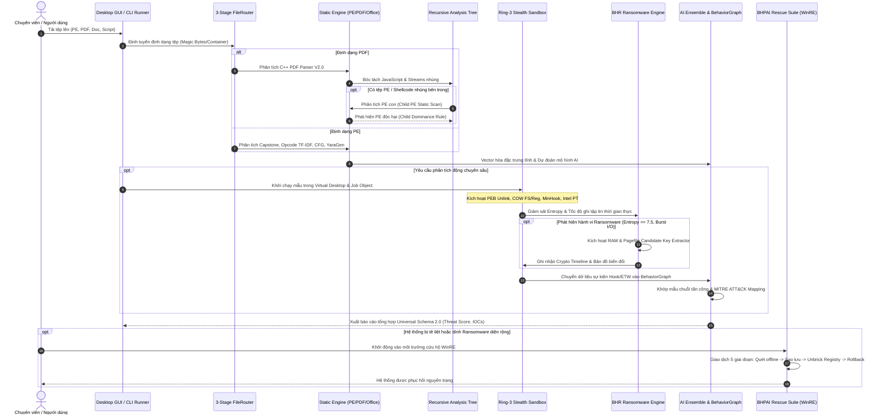

# TÀI LIỆU DỰ ÁN: BHPAI 
> **Phiên bản hệ thống**: V1.6 
> **Tác giả**: BHPAI Engineering Team  
> **Ngôn ngữ & Công nghệ cốt lõi**: C++17 (MinGW-w64 / MSYS2), Python 3.9+, PyQt6, MinHook, Capstone Engine, Intel PT (Processor Trace), PyTorch, LightGBM, OpenSSL 3.x, zlib, Argon2id, Cryptography, Ed25519  
> **Tài liệu tham chiếu Master**: Chi tiết kiến trúc đa định dạng (Multi-Format), giải thuật phân tích đệ quy, phân tích tĩnh PE & PDF, giám sát động Sandbox Stealth Ring-3, trích xuất cấu trúc khóa Ransomware, mô hình AI chống cảnh báo giả (False Positive Resistant), hệ thống cứu hộ ngoại tuyến WinRE và bảo mật dữ liệu Zero-Knowledge.

---

## MỤC LỤC TỔNG QUAN

1. [TỔNG QUAN DỰ ÁN & TẦM NHÌN KIẾN TRÚC ĐA ĐỊNH DẠNG](#1-tổng-quan-dự-án--tầm-nhìn-kiến-trúc-đa-định-dạng)
   - [1.1 Bối cảnh an ninh mạng & Thách thức bảo mật hiện đại](#11-bối-cảnh-an-ninh-mạng--thách-thức-bảo-mật-hiện-đại)
   - [1.2 Triết lý thiết kế Hybrid Đa định dạng (Multi-Format Tri-Layer Engine)](#12-triết-lý-thiết-kế-hybrid-đa-định-dạng-multi-format-tri-layer-engine)
   - [1.3 Bảng thông số kỹ thuật cốt lõi V1.6 (Technical Highlights)](#13-bảng-thông-số-kỹ-thuật-cốt-lõi-v16-technical-highlights)
2. [SƠ ĐỒ KIẾN TRÚC & LUỒNG XỬ LÝ DỮ LIỆU TỔNG THỂ](#2-sơ-đồ-kiến-trúc--luồng-xử-lý-dữ-liệu-tổng-thể)
3. [CHI TIẾT PHÂN HỆ 1: DYNAMIC WINDOWS SANDBOX & STEALTH MONITORING (RING-3)](#3-chi-tiết-phân-hệ-1-dynamic-windows-sandbox--stealth-monitoring-ring-3)
   - [3.1 Môi trường Desktop ảo hóa độc lập & Giới hạn Windows Job Object](#31-môi-trường-desktop-ảo-hóa-độc-lập--giới-hạn-windows-job-object)
   - [3.2 Tước bỏ đặc quyền nguy hiểm bằng Restricted Token](#32-tước-bỏ-đặc-quyền-nguy-hiểm-bằng-restricted-token)
   - [3.3 Kỹ thuật Anti-Evasion & Stealth (PEB Unlinking, Memory PE Wiping, DACL Guard)](#33-kỹ-thuật-anti-evasion--stealth-peb-unlinking-memory-pe-wiping-dacl-guard)
   - [3.4 Can thiệp Native NT API qua MinHook Engine & RAII HookGuard](#34-can-thiệp-native-nt-api-qua-minhook-engine--raii-hookguard)
   - [3.5 Công nghệ Copy-On-Write (COW) 2 lớp cho Filesystem & Registry](#35-công-nghệ-copy-on-write-cow-2-lớp-cho-filesystem--registry)
   - [3.6 Kernel Event Tracing (ETW Monitor)](#36-kernel-event-tracing-etw-monitor)
   - [3.7 Fake Network Engine (C2 Sinkhole & Payload Mocking)](#37-fake-network-engine-c2-sinkhole--payload-mocking)
   - [3.8 Giám sát Phần cứng Intel Processor Trace (Intel PT) Engine](#38-giám-sát-phần-cứng-intel-processor-trace-intel-pt-engine)
   - [3.9 Ranh giới Kỹ thuật & Giới hạn Thực tế của Môi trường Phân tích](#39-ranh-giới-kỹ-thuật--giới-hạn-thực-tế-của-môi-trường-phân-tích)
4. [CHI TIẾT PHÂN HỆ 2: STATIC PE ANALYZER & CAPSTONE DISASSEMBLER](#4-chi-tiết-phân-hệ-2-static-pe-analyzer--capstone-disassembler)
   - [4.1 Phân tích cấu trúc PE, Entropy Sections & Nhận diện Dị thường (Anomalies)](#41-phân-tích-cấu-trúc-pe-entropy-sections--nhận-diện-dị-thường-anomalies)
   - [4.2 Giải mã Opcode N-Grams & Trọng số TF-IDF](#42-giải-mã-opcode-n-grams--trọng-số-tf-idf)
   - [4.3 Chuỗi gọi API N-Grams & Đồ thị dòng điều khiển (CFG)](#43-chuỗi-gọi-api-n-grams--đồ-thị-dòng-điều-khiển-cfg)
   - [4.4 Bộ nhận diện & Tự động Giải nén Packer (UPX / WWPack Unpacker)](#44-bộ-nhận-diện--tự-động-giải-nén-packer-upx--wwpack-unpacker)
   - [4.5 Tự động sinh luật YARA nâng cao (YaraGen - Lọc Nhiễu Rust) & Fuzzy Hashing](#45-tự-động-sinh-luật-yara-nâng-cao-yaragen---lọc-nhiễu-rust--fuzzy-hashing)
5. [CHI TIẾT PHÂN HỆ 3: MULTI-FORMAT ENGINE & NATIVE C++ PDF ANALYZER V2.0](#5-chi-tiết-phân-hệ-3-multi-format-engine--native-c-pdf-analyzer-v20)
   - [5.1 Bộ định tuyến tệp 3 giai đoạn (FileRouter Engine)](#51-bộ-định-tuyến-tệp-3-giai-đoạn-filerouter-engine)
   - [5.2 Động cơ Phân tích PDF Native C++ V2.0 (`Analyzers/PDF/`)](#52-động-cơ-phân-tích-pdf-native-c-v20-analyzerspdf)
   - [5.3 Cây Phân tích Đệ quy Phân cấp (`AnalysisNode` Architecture)](#53-cây-phân-tích-đệ-quy-phân-cấp-analysisnode-architecture)
   - [5.4 Động cơ Chấm điểm Nguy cơ Ngữ cảnh & Quy tắc Thống trị Con (Child Dominance Rule)](#54-động-cơ-chấm-điểm-nguy-cơ-ngữ-cảnh--quy-tắc-thống-trị-con-child-dominance-rule)
   - [5.5 Phòng thủ Anti-DoS & Chống Bom Giải nén (Decompression Bomb Protection)](#55-phòng-thủ-anti-dos--chống-bom-giải-nén-decompression-bomb-protection)
   - [5.6 Ánh xạ MITRE ATT&CK Dựa trên Bằng chứng & Universal IOC Defanger](#56-ánh-xạ-mitre-attck-dựa-trên-bằng-chứng--universal-ioc-defanger)
   - [5.7 Chuẩn hóa Báo cáo Đầu ra Universal Schema 2.0](#57-chuẩn-hóa-báo-cáo-đầu-ra-universal-schema-20)
6. [CHI TIẾT PHÂN HỆ 4: DATASET 3 TẦNG & PIPELINE AI PDF CHỐNG FALSE POSITIVE](#6-chi-tiết-phân-hệ-4-dataset-3-tầng--pipeline-ai-pdf-chống-false-positive)
   - [6.1 Cấu trúc Phân tầng Dataset 3 Lớp (`dataset/pdf/`)](#61-cấu-trúc-phân-tầng-dataset-3-lớp-datasetpdf)
   - [6.2 Xóa bỏ lối tắt suy luận "False Positive Machine" qua Hard Negatives](#62-xóa-bỏ-lối-tắt-suy-luận-false-positive-machine-qua-hard-negatives)
   - [6.3 Khử trùng lặp đa cấp độ trước khi phân tách (Multi-Level Deduplication)](#63-khử-trùng-lặp-đa-cấp-độ-trước-khi-phân-tách-multi-level-deduplication)
   - [6.4 Phân tách tập độc lập chống rò rỉ dữ liệu `StratifiedGroupKFold`](#64-phân-tách-tập-độc-lập-chống-rò-rỉ-dữ-liệu-stratifiedgroupkfold)
   - [6.5 Vector 57 Đặc trưng & Hiệu chuẩn Xác suất (`CalibratedClassifierCV`)](#65-vector-57-đặc-trưng--hiệu-chuẩn-xác-suất-calibratedclassifiercv)
   - [6.6 Kết quả Benchmark Kiểm định & Khả năng Kháng Cảnh báo Giả (Audit Report)](#66-kết-quả-benchmark-kiểm-định--khả-năng-kháng-cảnh-báo-giả-audit-report)
7. [CHI TIẾT PHÂN HỆ 5: MACHINE LEARNING & AI ENSEMBLE (PE & GNN & SHAP)](#7-chi-tiết-phân-hệ-5-machine-learning--ai-ensemble-pe--gnn--shap)
   - [7.1 Hợp nhất Không gian Đặc trưng Đa chiều (Feature Vectorization)](#71-hợp-nhất-không-gian-đặc-trưng-đa-chiều-feature-vectorization)
   - [7.2 PyTorch API Sequence Embedder & Control Flow Graph GNN](#72-pytorch-api-sequence-embedder--control-flow-graph-gnn)
   - [7.3 Tối ưu hóa đặc trưng bằng SHAP Feature Pruning](#73-tối-ưu-hóa-đặc-trưng-bằng-shap-feature-pruning)
   - [7.4 Mô hình Phân loại LightGBM Ensemble (Adam, Eve, Marcus) & Ngưỡng động](#74-mô-hình-phân-loại-lightgbm-ensemble-adam-eve-marcus--ngưỡng-động)
   - [7.5 Kết Quả Benchmark & Đánh Giá Thực Nghiệm Bộ Phân Loại AI](#75-kết-quả-benchmark--đánh-giá-thực-nghiệm-bộ-phân-loại-ai)
8. [CHI TIẾT PHÂN HỆ 6: BHR ENGINE (RANSOMWARE DETECTOR & KEY RECOVERY)](#8-chi-tiết-phân-hệ-6-bhr-engine-ransomware-detector--key-recovery)
   - [8.1 Thuật toán phát hiện mã hóa Entropy cao (Shannon Entropy Rate)](#81-thuật-toán-phát-hiện-mã-hóa-entropy-cao-shannon-entropy-rate)
   - [8.2 Giám sát Burst Modification Rate & Hành vi xóa Shadow Copy](#82-giám-sát-burst-modification-rate--hành-vi-xóa-shadow-copy)
   - [8.3 Trích xuất cấu trúc khóa mã hóa (20+ Standards) từ RAM & `pagefile.sys`](#83-trích-xuất-cấu-trúc-khóa-mã-hóa-20-standards-từ-ram--pagefilesys)
   - [8.4 Khôi phục dữ liệu từ Vùng đệm COW Virtual Overlay (Win32/NT Scope)](#84-khôi-phục-dữ-liệu-từ-vùng-đệm-cow-virtual-overlay-win32nt-scope)
   - [8.5 Nhật ký Crypto Timeline & Bản đồ biến đổi dữ liệu](#85-nhật-ký-crypto-timeline--bản-đồ-biến-đổi-dữ-liệu)
   - [8.6 Kiểm thử Thực nghiệm Dual-Engine Hybrid Ransomware Memory Key Extraction](#86-kiểm-thử-thực-nghiệm-dual-engine-hybrid-ransomware-memory-key-extraction)
   - [8.7 Kiến trúc Recovery Engine Registry & Crypto Dataflow Tracker](#87-kiến-trúc-recovery-engine-registry--crypto-dataflow-tracker)
9. [CHI TIẾT PHÂN HỆ 7: BEHAVIOR CORRELATOR & BEHAVIORGRAPH ENGINE V1.6](#9-chi-tiết-phân-hệ-7-behavior-correlator--behaviorgraph-engine-v16)
   - [9.1 Chuẩn hóa sự kiện đa nguồn (Userland Hooks + Kernel ETW)](#91-chuẩn-hóa-sự-kiện-đa-nguồn-userland-hooks--kernel-etw)
   - [9.2 Đồ thị Hướng Liên Tiến Trình (`BehaviorGraph`) & State Machine Chuỗi Tấn Công](#92-đồ-thị-hướng-liên-tiến-trình-behaviorgraph--state-machine-chuỗi-tấn-công)
   - [9.3 Độ phủ Win32 / NT Native API & Chuẩn hóa Đường dẫn Kernel](#93-độ-phủ-win32--nt-native-api--chuẩn-hóa-đường-dẫn-kernel)
   - [9.4 Giám sát Registry Native & Bộ Phân loại Persistence 9 Điểm](#94-giám-sát-registry-native--bộ-phân-loại-persistence-9-điểm)
   - [9.5 Stateful NetworkSessionTracker & Bộ Bóc Tách TLS SNI / HTTP](#95-stateful-networksessiontracker--bộ-bóc-tách-tls-sni--http)
   - [9.6 Mô hình Nhật ký Mã hóa Cấu trúc Enriched CryptoOperation](#96-mô-hình-nhật-ký-mã-hóa-cấu-trúc-enriched-cryptooperation)
   - [9.7 Bản đồ ma trận kỹ thuật MITRE ATT&CK Enterprise Matrix](#97-bản-đồ-ma-trận-kỹ-thuật-mitre-attck-enterprise-matrix)
   - [9.8 Bộ Thử Nghiệm Tự Động 7 Chiều & Kết Quả Benchmark V1.6](#98-bộ-thử-nghiệm-tự-động-7-chiều--kết-quả-benchmark-v16)
10. [CHI TIẾT PHÂN HỆ 8: ZERO-KNOWLEDGE ENCRYPTED BACKUP VAULT](#10-chi-tiết-phân-hệ-8-zero-knowledge-encrypted-backup-vault)
    - [10.1 Mô hình mã hóa Client-Side E2EE & Cây sinh khóa KDF/HKDF](#101-mô-hình-mã-hóa-client-side-e2ee--cây-sinh-khóa-kdfhkdf)
    - [10.2 Giao thức xác thực không tiết lộ tri thức SRP-6a PAKE (RFC 5054)](#102-giao-thức-xác-thực-không-tiết-lộ-tri-thức-srp-6a-pake-rfc-5054)
    - [10.3 Cơ chế Đổi mật khẩu tức thì (Instant Re-Keying Mechanism)](#103-cơ-chế-đổi-mật-khẩu-tức-thì-instant-re-keying-mechanism)
    - [10.4 Xác thực AAD Chuẩn hóa & Bucket Size Padding chống phân tích lưu lượng](#104-xác-thực-aad-chuẩn-hóa--bucket-size-padding-chống-phân-tích-lưu-lượng)
    - [10.5 Kiến trúc Lưu trữ Khối Cục bộ Mã hóa (Local Encrypted Block Store)](#105-kiến-trúc-lưu-trữ-khối-cục-bộ-mã-hóa-local-encrypted-block-store)
11. [CHI TIẾT PHÂN HỆ 9: GIAO DIỆN DESKTOP PYQT6 GLASSMORPHISM, BẢN QUYỀN HWID & CÔNG CỤ CLI](#11-chi-tiết-phân-hệ-9-giao-diện-desktop-pyqt6-glassmorphism-bản-quyền-hwid--công-cụ-cli)
    - [11.1 Kiến trúc Giao diện PyQt6 Desktop Glassmorphism (Multi-Threading QThread)](#111-kiến-trúc-giao-diện-pyqt6-desktop-glassmorphism-multi-threading-qthread)
    - [11.2 Các Tab Chức Năng Cốt Lõi Trên Desktop GUI](#112-các-tab-chức-năng-cốt-lõi-trên-desktop-gui)
    - [11.3 Hệ thống Bản quyền Khóa cứng Phần cứng (HWID-Locked Licensing & Ed25519)](#113-hệ-thống-bản-quyền-khóa-cứng-phần-cứng-hwid-locked-licensing--ed25519)
    - [11.4 Động cơ Threat Intelligence & Universal IOC Defanger Độc Lập](#114-động-cơ-threat-intelligence--universal-ioc-defanger-độc-lập)
    - [11.5 Hệ thống Báo cáo Đa định dạng Universal Schema 2.0 (JSON, Markdown, PDF)](#115-hệ-thống-báo-cáo-đa-định-dạng-universal-schema-20-json-markdown-pdf)
12. [CHI TIẾT PHÂN HỆ 10: BHPAI RESCUE SUITE & KHỞI ĐỘNG CỨU HỘ KHẨN CẤP WINRE](#12-chi-tiết-phân-hệ-10-bhpai-rescue-suite--khởi-động-cứu-hộ-khẩn-cấp-winre)
    - [12.1 Môi trường Cứu hộ Ngoại tuyến Windows Recovery Environment (WinRE)](#121-môi-trường-cứu-hộ-ngoại-tuyến-windows-recovery-environment-winre)
    - [12.2 Kiến Trúc 7 Phân Hệ Cốt Lõi Của `bhpai_rescue.exe`](#122-kiến-trúc-7-phân-hệ-cốt-lõi-của-bhpai_rescueexe)
    - [12.3 Quy Trình Giao Dịch Khắc Phục 5 Giai Đoạn (5-Phase Transaction Pipeline)](#123-quy-trình-giao-dịch-khắc-phục-5-giai-đoạn-5-phase-transaction-pipeline)
    - [12.4 Cơ Chế Tự Phục Hồi Khi Gặp Sự Cố (Crash State Recovery)](#124-cơ-chế-tự-phục-hồi-khi-gặp-sự-cố-crash-state-recovery)
    - [12.5 Kịch bản Triển khai & Khởi động WinRE Tự động](#125-kịch-bản-triển-khai--khởi-động-winre-tự-động)
    - [12.6 Hướng Dẫn Vận Hành & Tham Số Dòng Lệnh `bhpai_rescue.exe`](#126-hướng-dẫn-vận-hành--tham-số-dòng-lệnh-bhpai_rescueexe)

---

## 1. TỔNG QUAN DỰ ÁN & TẦM NHÌN KIẾN TRÚC ĐA ĐỊNH DẠNG

### 1.1 Bối cảnh an ninh mạng & Thách thức bảo mật hiện đại
Trong kỷ nguyên an ninh mạng hiện nay, các cuộc tấn công có chủ đích (APT), mã độc gián điệp, và mã độc tống tiền (Ransomware) đã vượt ra ngoài phạm vi của các tập tin thực thi truyền thống (`.exe`, `.dll`):
1. **Tấn công Đa định dạng & Vũ khí hóa Tài liệu (Document Weaponization)**: Mã độc xâm nhập ban đầu qua tài liệu PDF độc hại (chứa mã khai thác lỗ hổng Adobe Acrobat CVE, Javascript bị làm mờ, action `/Launch` thực thi command ngầm) hoặc đóng gói tệp thực thi PE nhúng bên trong PDF dạng Dropper.
2. **Lẩn tránh Phân tích Tĩnh (Static Evasion)**: Sử dụng các biến thể đa hình (Polymorphic), biến hình (Metamorphic), nén nhiều lớp (Packers), hoặc chèn các thành phần giả mạo hợp lệ nhằm đánh lừa mô hình học máy đơn giản tạo thành các lối tắt học vẹt (Heuristic Shortcut Failure).
3. **Lẩn tránh Môi trường Phân tích Động (Anti-Sandbox / Anti-Analysis)**: Quét bộ nhớ phát hiện các DLL giám sát nạp trong tiến trình, kiểm tra PEB module list, tháo gỡ hook (Unhooking), phát hiện môi trường máy ảo và thực hiện kỹ thuật ngủ (Sleep Acceleration Evasion).
4. **Phá hủy Dữ liệu Tốc độ Cao (High-speed Crypto Destruction)**: Các biến thể Ransomware thế hệ mới (LockBit 3.0, BlackCat, Hyper, Conti) sử dụng song song nhiều thuật toán mã hóa (Dual-Engine Hybrid: AES-256-GCM + ChaCha20 + X25519/RSA), xóa các điểm khôi phục Volume Shadow Copies và thay đổi dữ liệu trước khi các hệ thống truyền thống kịp phát hiện.

**BHPAI (Behavioral Hybrid Predictive AI)** phiên bản **V1.6 Enterprise** là hệ thống an ninh mạng đa tầng, cung cấp giải pháp bảo vệ toàn diện cho chuỗi tấn công thông qua kiến trúc **Multi-Format Hybrid Engine**: Định tuyến tự động đa định dạng (PE, PDF, Office, Script), phân tích đệ quy payload lồng nhau, cô lập Sandbox Ring-3 stealth, giám sát phần cứng Intel PT, và mô hình AI hiệu chuẩn chống cảnh báo giả.

---

### 1.2 Triết lý thiết kế Hybrid Đa định dạng (Multi-Format Tri-Layer Engine)

BHPAI V1.6 được thiết kế dựa trên mô hình **Định tuyến - Phân giải Đệ quy - Tương quan Hành vi - Phục hồi Ngoại tuyến**:

```
                         ┌───────────────────────────────────────────────┐
                         │               INPUT FILE STREAM               │
                         └───────────────────────┬───────────────────────┘
                                                 │
                                     ┌───────────▼───────────┐
                                     │  3-STAGE FILE ROUTER  │
                                     │  (Magic/ZIP/Script)   │
                                     └───────────┬───────────┘
                                                 │
                  ┌──────────────────────────────┼──────────────────────────────┐
                  │                              │                              │
         [FileFormat::PE]               [FileFormat::PDF]              [FileFormat::Office]
                  │                              │                              │
     ┌────────────▼────────────┐    ┌────────────▼────────────┐    ┌────────────▼────────────┐
     │  STATIC PE ANALYZER     │    │  PDF ANALYZER V2.0      │    │  OOXML / OLE ANALYZER   │
     │  - Capstone Disassembler│    │  - Binary Stream Parser │    │  - Macro VBA Extractor  │
     │  - Opcode TF-IDF & CFG  │    │  - Action/JS Deobfuscate│    │  - External DDE Links   │
     │  - YaraGen & Fuzzy Hash │    │  - 57 Features + Level 2│    │  - Embedded OLE Objects │
     └────────────┬────────────┘    │    Structural Fingerprnt│    └────────────┬────────────┘
                  │                 └────────────┬────────────┘                 │
                  │                              │                              │
                  │                  (Trích xuất Embedded PE)                   │
                  │                              │                              │
                  │                 ┌────────────▼────────────┐                 │
                  └────────────────►│ RECURSIVE ANALYSIS TREE │◄────────────────┘
                                    │    (AnalysisNode Tree)  │
                                    └────────────┬────────────┘
                                                 │
                                    ┌────────────▼────────────┐
                                    │  DYNAMIC SECURE SANDBOX │
                                    │  - Job Object & Token   │
                                    │  - COW Overlay FS/Reg   │
                                    │  - Stealth PEB Unlink   │
                                    │  - Intel PT Hardware Trc│
                                    └────────────┬────────────┘
                                                 │
                  ┌──────────────────────────────┴──────────────────────────────┐
                  │                                                             │
     ┌────────────▼────────────┐                                   ┌────────────▼────────────┐
     │ BHR RANSOMWARE ENGINE   │                                   │ AI & BEHAVIORGRAPH V1.6 │
     │ - High-Entropy Detector │                                   │ - Multi-Format Ensemble │
     │ - RAM & Pagefile Keys   │                                   │ - Cross-Process Machine │
     │ - Instant COW Rollback  │                                   │ - MITRE ATT&CK Mapping  │
     └─────────────────────────┘                                   └─────────────────────────┘
```

1. **Safety First & Anti-Bomb (An toàn & Phòng vệ DoS)**: Sandbox cách ly tiến trình qua Desktop ảo riêng biệt (`BHPAISandboxDesktop`), giới hạn Job Object (RAM 512MB, CPU, cấm Breakaway) và hạ đặc quyền với Restricted Token. Bộ giải nén dòng PDF được bảo vệ bởi `AnalysisBudget` và `ParserLimits` chống Decompression Bomb (tỷ lệ nén tối đa 100:1, giới hạn dung lượng và độ sâu lồng nhau).
2. **Stealth Anti-Evasion (Giảm thiểu footprint User-mode)**: DLL giám sát Ring-3 chủ động giảm thiểu dấu vết đối với các kỹ thuật anti-analysis thông thường qua việc gỡ bỏ khỏi 3 danh sách liên kết kép PEB Module (`InLoadOrder`, `InMemoryOrder`, `InInitializationOrder`), xóa PE Header & Debug PDB trong RAM, và thiết lập DACL bảo vệ Launcher chống lại các lệnh `OpenProcess(PROCESS_TERMINATE)` cơ bản.
3. **Recursive Analysis Tree & Child Dominance (Phân tích đệ quy & Thống trị con)**: Kiến trúc cây `AnalysisNode` kiểm tra đệ quy mọi tệp tin nhúng bên trong tài liệu. Khi phát hiện một tệp thực thi con (Child PE) là độc hại, hệ thống kích hoạt **Child Dominance Rule**, tự động nâng cấp kết luận của tài liệu cha lên **MALICIOUS** với điểm rủi ro tối thiểu 85/100.
4. **False-Positive Resistance AI (Kháng cảnh báo giả)**: Loại bỏ lối tắt suy luận sai lầm nhờ tổ chức tập dữ liệu 3 tầng (`suspicious_benign`), khử trùng lặp đa cấp (Exact Hash + Structural Fingerprint) và phân rã nhóm `StratifiedGroupKFold`.
5. **Data Protection & Key Recovery (Phát hiện & Hỗ trợ trích xuất khóa ứng viên)**: BHR Engine phát hiện hành vi mã hóa entropy dồn dập trong phạm vi Win32/NT I/O, quét tìm các cấu trúc khóa ứng viên (AES-GCM GHASH $H$, ChaCha20 state, RSA DER, X25519) trong RAM và `pagefile.sys` trước khi tiến trình giải phóng bộ nhớ, đồng thời hỗ trợ rollback các tệp đã ghi vào vùng đệm COW Overlay đối với các hoạt động I/O chuẩn.

---

### 1.3 Bảng thông số kỹ thuật cốt lõi V1.6 (Technical Highlights)

| Phân hệ & Tiêu chí | Thông số Kỹ thuật & Công nghệ triển khai V1.6 |
| :--- | :--- |
| **Định tuyến tệp (File Router)** | 3-Stage: Magic Bytes (PE, PDF, PK, OLE2, Shebang) + Container Inspection (In-memory ZIP for DOCX/XLSX/PPTX) + Script Classifier (PS1, VBS, JS, BAT, HTA) |
| **Phân tích PDF Native V2.0** | C++17 Binary-Safe Parser, FlateDecode/ASCIIHex Inflate, Recursive Embedded Payloads (`MZ`), Javascript Obfuscation & Acrobat API Analyzer, 57 Vector Features |
| **Phòng thủ Anti-Bomb / DoS** | `ParserLimits`: Max Input 500MB, Max Extracted 250MB, Max Ratio 100.0, Max Objects 100K, Max Filter Depth 6, Timeout 30 giây |
| **Môi trường Sandbox** | Windows Job Object (RAM 512MB, CPU Affinity, No Breakaway, UILIMITs) + Restricted Token (Drop Dangerous Privileges) + Virtual Desktop |
| **Ảo hóa Filesystem/Registry** | Copy-On-Write (COW) Virtual Overlay 2 lớp hỗ trợ Alternate Data Streams (ADS), Reparse Points, và Merged Virtual Registry View |
| **Kỹ thuật Stealth Monitor** | Unlink PEB (`InLoadOrder`, `InMemoryOrder`, `InInitializationOrder`) + In-Memory PE Header Scrubber + PDB Wiping + Launcher DACL Guard |
| **Hooking & Đồ thị Hành vi** | MinHook Engine + RAII `HookGuard` + `BehaviorGraph` liên tiến trình (Remote Thread, Process Hollowing, APC Queue Injection) |
| **Giám sát Phần cứng Intel PT** | Hardware-Assisted Tracing via CPUID leaf 0x14, `ProcessIntelProcessorTrace` Class 47, TNT/TIP/FUP Packet Decoder |
| **Phân tích Tĩnh PE (Static)** | Capstone Disassembler (x86/x64) + Opcode TF-IDF + API N-Grams + CFG Cyclomatic Complexity + YaraGen (Rust Blacklist) + SSDEEP/TLSH |
| **Bộ Mô hình AI / Machine Learning** | PyTorch Sequence Embedder + GNN trên CFG + LightGBM Ensemble (Adam, Eve, Marcus) + SHAP Feature Pruning + PDF Calibrated LGBM |
| **Huấn luyện Chống False Positive** | Dataset 3 tầng (`malware`, `benign`, `suspicious_benign`), Dedup cấp 1 (SHA256) & cấp 2 (Structural Fingerprint), `StratifiedGroupKFold` |
| **Phát hiện Ransomware** | Real-time Shannon Entropy Calculation ($\ge 7.5$) + Burst Modification Rate ($>20$ files/s) + Shadow Copy Wiping Detector |
| **Trích xuất Khóa & Khôi phục** | RAM & `pagefile.sys` Extractor cho 20+ thuật toán (AES-GCM GHASH $H$, ChaCha20, RSA DER, X25519 Clamping) + Automated COW Rollback |
| **Sao lưu Mã hóa Độc lập (Vault)** | Client-Side Zero-Knowledge E2EE (AES-256-GCM) + SRP-6a PAKE (RFC 5054) + Instant Re-Keying ($K_{\text{vault}}$) + Canonical AAD |
| **Cứu hộ Ngoại tuyến WinRE** | `bhpai_rescue.exe` C++17 standalone, 7 phân hệ, 5-Phase ACID transaction, Crash state recovery, tự động mount registry offline |
| **Giao diện Desktop & Bản quyền** | PyQt6 Dark Glassmorphism GUI (QThread workers) + Ed25519 HWID Hardware-Locked Licensing engine |

---

## 2. SƠ ĐỒ KIẾN TRÚC & LUỒNG XỬ LÝ DỮ LIỆU TỔNG THỂ

Sơ đồ trình tự thể hiện luồng xử lý từ khi tiếp nhận tập tin đầu vào cho đến khi trích xuất payload, phân tích tĩnh/động, phân loại AI và khôi phục dữ liệu:



---

## 3. CHI TIẾT PHÂN HỆ 1: DYNAMIC WINDOWS SANDBOX & STEALTH MONITORING (RING-3)

Mã nguồn chính nằm tại: [`BHPAISandbox.cpp`](file:///c:/Users/Kryo/Documents/BHPAI/BHPAISandbox.cpp), [`BHPAIMonitor.cpp`](file:///c:/Users/Kryo/Documents/BHPAI/BHPAIMonitor.cpp), [`SafeVirtualDesktop.cpp`](file:///c:/Users/Kryo/Documents/BHPAI/SafeVirtualDesktop.cpp), [`SafeJobObject.cpp`](file:///c:/Users/Kryo/Documents/BHPAI/SafeJobObject.cpp), [`IntelPTMonitor.cpp`](file:///c:/Users/Kryo/Documents/BHPAI/IntelPTMonitor.cpp), [`FakeNetEngine.cpp`](file:///c:/Users/Kryo/Documents/BHPAI/FakeNetEngine.cpp).

### 3.1 Môi trường Desktop ảo hóa độc lập & Giới hạn Windows Job Object
1. **Virtual Desktop (`BHPAISandboxDesktop`)**: Khởi tạo bằng `CreateDesktopW` với cờ `DESKTOP_CREATEWINDOW | DESKTOP_WRITEOBJECTS`. Mọi cửa sổ đồ họa, thông điệp Windows Message (`WM_DROPFILES`, `WM_COPYDATA`, UI Redirection) của mã độc bị giam giữ hoàn toàn trong Desktop ảo, cô lập với màn hình người dùng (`Default` Desktop).
2. **Windows Job Object (`SafeJobObject`)**:
   - `JOB_OBJECT_LIMIT_KILL_ON_JOB_CLOSE`: Khi tiến trình Launcher thoát, toàn bộ cây tiến trình con của mã độc tự động bị hủy.
   - `JOB_OBJECT_LIMIT_PROCESS_MEMORY`: Giới hạn RAM tối đa 512MB/tiến trình chống cạn kiệt tài nguyên hệ thống.
   - `JOB_OBJECT_LIMIT_ACTIVE_PROCESS`: Giới hạn tối đa 32 tiến trình đồng thời chống tấn công Fork-Bomb.
   - `JOB_OBJECT_LIMIT_DIE_ON_UNHANDLED_EXCEPTION`: Chặn cửa sổ Windows Error Reporting Crash Dialog.
   - `JOB_OBJECT_UILIMIT_HANDLES | JOB_OBJECT_UILIMIT_GLOBALATOMS`: Ngăn chặn can thiệp Handle và Atoms toàn cục.

---

### 3.2 Tước bỏ đặc quyền nguy hiểm bằng Restricted Token
Launcher tạo Token giới hạn qua `CreateRestrictedToken` trước khi gọi `CreateProcessAsUserW`:
- **Disable SIDs**: `WinBuiltinAdministratorsSid`, `WinLocalSystemSid`, `WinLocalAdminSid`.
- **Privileges to Remove**: Xóa bỏ hoàn toàn các đặc quyền nhạy cảm: `SeDebugPrivilege`, `SeTcbPrivilege`, `SeTakeOwnershipPrivilege`, `SeLoadDriverPrivilege`, `SeBackupPrivilege`, `SeRestorePrivilege`, `SeShutdownPrivilege`, `SeImpersonatePrivilege`.
- **Mandatory Integrity Level**: Hạ xuống mức `SECURITY_MANDATORY_LOW_RID` hoặc `SECURITY_MANDATORY_MEDIUM_RID`.

---

### 3.3 Kỹ thuật Anti-Evasion & Stealth (PEB Unlinking, Memory PE Wiping, DACL Guard)

Để giảm thiểu khả năng bị mã độc phát hiện DLL giám sát trong không gian bộ nhớ Ring-3:
1. **PEB Module List Unlinking**:
   DLL `BHPAIMonitor.dll` tự động gỡ bỏ `LDR_DATA_TABLE_ENTRY` của chính nó ra khỏi 3 danh sách liên kết kép trong Process Environment Block (PEB):
   - `InLoadOrderModuleList`
   - `InMemoryOrderModuleList`
   - `InInitializationOrderModuleList`
   Khi mã độc duyệt `PEB->Ldr` hoặc gọi `EnumProcessModules`, module giám sát không hiển thị trong danh sách.
2. **In-Memory PE Header & Section Scrubber**:
   Ghi đè `PAGE_READWRITE` và xóa trắng (Zero-fill) vùng `IMAGE_DOS_HEADER`, `IMAGE_NT_HEADERS`, `IMAGE_SECTION_HEADER` và chuỗi Debug Directory PDB Path của DLL trong bộ nhớ RAM, ngăn chặn kỹ thuật quét chữ ký bộ nhớ.
3. **Launcher DACL Guard**:
   Tiến trình điều khiển thiết lập `SetKernelObjectSecurity` với danh sách điều khiển truy cập tùy ý (DACL) rỗng, từ chối quyền `PROCESS_TERMINATE`, `PROCESS_VM_WRITE`, và `PROCESS_SUSPEND_RESUME` từ các tiến trình có mức toàn vẹn thấp hơn.

---

### 3.4 Can thiệp Native NT API qua MinHook Engine & RAII HookGuard
Hệ thống sử dụng **MinHook Engine** can thiệp trực tiếp vào các hàm Native NT API mức thấp trong `ntdll.dll` và `kernelbase.dll`:

| Nhóm API | Hàm Native Hooked | Mục đích Giám sát & Chuyển hướng |
| :--- | :--- | :--- |
| **Process / Thread** | `NtCreateProcessEx`, `NtCreateUserProcess`, `NtCreateThreadEx`, `NtQueueApcThread` | Phát hiện tạo tiến trình con, Process Injection, APC Injection. |
| **Virtual Memory** | `NtAllocateVirtualMemory`, `NtProtectVirtualMemory`, `NtWriteVirtualMemory` | Nhận diện cấp phát `PAGE_EXECUTE_READWRITE`, Process Hollowing, Shellcode Injection. |
| **Filesystem I/O** | `NtCreateFile`, `NtOpenFile`, `NtWriteFile`, `NtSetInformationFile`, `NtDeleteFile` | Ghi nhận I/O, chuyển hướng COW Overlay, đo lường Shannon Entropy. |
| **Registry** | `NtCreateKey`, `NtOpenKey`, `NtSetValueKey`, `NtDeleteValueKey` | Giám sát điểm cắm chốt tự khởi động (Persistence) và chuyển hướng COW. |
| **Anti-Analysis** | `NtQueryInformationProcess`, `NtSetInformationThread`, `NtDelayExecution` | Chặn phát hiện `ProcessDebugPort`, ThreadHideFromDebugger, tăng tốc Sleep Evasion. |

Mọi hàm hook đều được bảo vệ bởi lớp **`RAII HookGuard`** (`thread_local bool in_hook`), đảm bảo chống hiện tượng lặp vô hạn (Recursive Hook Loop Deadlock).

---

### 3.5 Công nghệ Copy-On-Write (COW) 2 lớp cho Filesystem & Registry
Để bảo vệ an toàn cho hệ thống thật trong khi vẫn cho phép mã độc tương tác bình thường:
1. **Filesystem Overlay Layer**:
   - Khi mã độc mở file ở chế độ `GENERIC_READ`, hệ thống cho phép đọc từ tệp gốc.
   - Khi có thao tác ghi `GENERIC_WRITE` hoặc xóa `FILE_DELETE_ON_CLOSE`: Tệp gốc lập tức được sao chép sang thư mục tạm ảo hóa `BHPAI_Sandbox_Overlay\Files\`. Mọi thao tác biến đổi dữ liệu thực thi trên bản sao này.
   - Hỗ trợ đầy đủ các tính năng nâng cao: Alternate Data Streams (ADS `file.txt:zone.identifier`), Reparse Points và Symbolic Links.
2. **Registry Overlay Layer**:
   - Các khóa Registry hệ thống (`HKLM\Software\Microsoft\Windows\CurrentVersion\Run`) được ánh xạ sang nhánh tạm `HKCU\Software\BHPAI_Virtual_Registry\`.
   - Cung cấp chế độ xem hợp nhất (Merged View): Đọc dữ liệu thực nhưng ghi đè dữ liệu ảo.

---

### 3.6 Kernel Event Tracing (ETW Monitor)
Sử dụng phân hệ **Microsoft Event Tracing for Windows (ETW)** bắt các sự kiện từ Kernel:
- `Microsoft-Windows-Kernel-Process`: Bắt sự kiện tạo tiến trình ngay cả khi mã độc sử dụng Direct Syscalls bypass Userland Hooks.
- `Microsoft-Windows-Kernel-Network`: Ghi nhận các kết nối TCP/UDP mức thấp.
- `Microsoft-Windows-Kernel-Memory`: Theo dõi các thao tác ánh xạ bộ nhớ chéo (Cross-Process Memory Mapping).

---

### 3.7 Fake Network Engine (C2 Sinkhole & Payload Mocking)
Tích hợp động cơ giả lập mạng độc lập (`FakeNetEngine.cpp`):
- **DNS Sinkhole**: Đón bắt mọi truy vấn DNS (Port 53) và trả về IP Loopback (`127.0.0.1`).
- **HTTP / HTTPS Mocking**: Lắng nghe Port 80, 8080, 443; phân tích gói tin TLS ClientHello để bóc tách Server Name Indication (SNI) và trả về phản hồi HTTP 200 OK với payload an toàn.
- **C2 Beacon Interceptor**: Thu thập toàn bộ dữ liệu Exfiltration (dữ liệu đánh cắp) của mã độc để phục vụ công tác điều tra số.

---

### 3.8 Giám sát Phần cứng Intel Processor Trace (Intel PT) Engine
Phân hệ `IntelPTMonitor.cpp` khai thác tính năng theo dõi phần cứng của CPU Intel:
- Kiểm tra tính tương thích qua lệnh `__cpuidex(0x14, 0)`.
- Cấu hình ToPA (Table of Physical Addresses) thông qua Windows Kernel Tracing API (`ProcessIntelProcessorTrace`).
- Thu thập gói tin phần cứng `TNT` (Taken/Not-Taken Branch), `TIP` (Target IP) và `FUP` (Function Pointer), cho phép phát hiện ROP (Return-Oriented Programming) Chains và giải mã luồng thực thi mà không phụ thuộc vào phần mềm.

---

### 3.9 Ranh giới Kỹ thuật & Giới hạn Thực tế của Môi trường Phân tích

Mặc dù được thiết kế với nhiều lớp bảo vệ, môi trường phân tích động Ring-3 vẫn có những ranh giới kỹ thuật tự nhiên cần được hiểu rõ trong thực tế tác chiến:

1. **Giới hạn Cấp độ Đặc quyền (Ring-3 Userland vs Ring-0 Kernel)**:
   - Các kỹ thuật Userland Hooking (MinHook) và PEB Unlinking chỉ hoạt động trong không gian địa chỉ Ring-3 của tiến trình.
   - Nếu mã độc sử dụng lỗ hổng Bring Your Own Vulnerable Driver (BYOVD) hoặc khai thác lỗ hổng hạt nhân để tải mã thực thi vào Kernel (Ring-0), nó có thể vượt qua các móc nối Userland Hook, truy cập trực tiếp đĩa vật lý (bỏ qua COW Overlay) hoặc vô hiệu hóa cơ chế thu thập dữ liệu ETW.
2. **Kỹ thuật Direct Syscalls & Dynamic API Resolution**:
   - Khi mã độc tự bóc tách số hiệu Syscall (SSN - System Service Number) từ tệp `ntdll.dll` trên đĩa và thực thi lệnh nhị phân `syscall` / `sysenter` trực tiếp từ bộ nhớ riêng, luồng thực thi sẽ nhảy thẳng vào Kernel mà không đi qua các hàm được MinHook cài đặt trong `ntdll.dll`.
   - Trong kịch bản này, BHPAI kết hợp bổ trợ dữ liệu từ **Kernel ETW Provider** và **Intel PT Hardware Trace** để bù đắp sự thiếu hụt của Userland Hooks.
3. **Môi trường Giả lập & Thời gian Phân tích (Time-Limited Dynamic Run)**:
   - Một số dòng APT tinh vi áp dụng cơ chế kích hoạt trễ dài hạn (Long Sleep Logic, Logic Bombs yêu cầu tương tác chuột/bàn phím phức tạp, hoặc đòi hỏi kết nối C2 hợp lệ từ máy chủ của kẻ tấn công). Phân tích động tự động trong khoảng thời gian giới hạn (thường từ 30 đến 120 giây) có thể chưa bao quát hết mọi nhánh thực thi sâu. Do đó, việc kết hợp đồng thời với **Static Disassembly** và **Mô hình AI Đa tầng** là điều kiện tiên quyết để đảm bảo độ chính xác.

---

## 4. CHI TIẾT PHÂN HỆ 2: STATIC PE ANALYZER & CAPSTONE DISASSEMBLER

Mã nguồn chính nằm tại: [`Core/analyzer/`](file:///c:/Users/Kryo/Documents/BHPAI/Core/analyzer), [`Analyzers/PE/`](file:///c:/Users/Kryo/Documents/BHPAI/Analyzers/PE), [`pe_analyzer.exe`](file:///c:/Users/Kryo/Documents/BHPAI/pe_analyzer.exe).

### 4.1 Phân tích cấu trúc PE, Entropy Sections & Nhận diện Dị thường (Anomalies)
1. **Phân tích Cấu trúc Header**:
   - `IMAGE_DOS_HEADER`, `IMAGE_NT_HEADERS` (32-bit & 64-bit).
   - Kiểm tra `OptionalHeader.AddressOfEntryPoint`, `ImageBase`, `Subsystem`, `DllCharacteristics` (ASLR, DEP, CFG, High Entropy VA).
2. **Section Entropy Analysis**:
   - Tính toán Shannon Entropy cho từng Section:
     $$H(X) = -\sum_{i=0}^{255} p(x_i) \log_2 p(x_i)$$
   - Nhận diện các Section bị nén hoặc mã hóa bất thường ($H \ge 7.0$).
3. **Nhận diện Dị thường (PE Anomalies)**:
   - Entry point nằm ngoài các Section thực thi chuẩn.
   - Kích thước `SizeOfRawData` sai lệch lớn so với `VirtualSize`.
   - Section có thuộc tính đồng thời `IMAGE_SCN_MEM_WRITE | IMAGE_SCN_MEM_EXECUTE` (W^X Violation).
   - Dấu vết thời gian (TimeDateStamp) trong quá khứ bất thường hoặc tương lai.

---

### 4.2 Giải mã Opcode N-Grams & Trọng số TF-IDF
1. **Capstone Disassembly Engine**:
   - Khởi tạo `cs_open(CS_ARCH_X86, CS_MODE_32 / CS_MODE_64)` với cấu hình chi tiết `CS_OPT_DETAIL`.
   - Giải mã toàn bộ luồng lệnh nhị phân trong Section thực thi (`.text`, `.code`).
2. **Trích xuất Opcode N-Grams (N=2, 3, 4)**:
   - Chuyển đổi mã máy sang chuỗi ngữ nghĩa Opcode trừu tượng hóa (ví dụ: `mov -> push -> call -> test -> jz`).
3. **Trọng số TF-IDF**:
   - Áp dụng ma trận Term Frequency-Inverse Document Frequency trích xuất các đặc trưng hướng dòng lệnh đặc thù của mã độc (mã hóa XOR vòng lặp, giải mã chuỗi động, thao tác Stack Strings).

---

### 4.3 Chuỗi gọi API N-Grams & Đồ thị dòng điều khiển (CFG)
1. **Import Table & API Call Graph**:
   - Bóc tách toàn bộ `IMAGE_IMPORT_DESCRIPTOR` (IAT) và phân tích các cặp API có tính nghi ngờ cao:
     - `VirtualAlloc` $
ightarrow$ `WriteProcessMemory` $
ightarrow$ `CreateRemoteThread`.
     - `FindResource` $
ightarrow$ `LoadResource` $
ightarrow$ `LockResource` $
ightarrow$ `SizeofResource`.
     - `CryptAcquireContext` $
ightarrow$ `CryptGenKey` $
ightarrow$ `CryptEncrypt`.
2. **Xây dựng Control Flow Graph (CFG)**:
   - Phân đoạn hàm thành các Basic Blocks (Khối lệnh cơ bản kết thúc bởi lệnh rẽ nhánh `jmp`, `call`, `ret`, `je`, `jne`).
   - Tính toán độ phức tạp chu trình Cyclomatic Complexity:
     $$M = E - N + 2P$$
     *(Trong đó: $E$ là số cạnh, $N$ là số đỉnh Basic Block, $P$ là số thành phần liên thông).*

---

### 4.4 Bộ nhận diện & Tự động Giải nén Packer (UPX / WWPack Unpacker)
1. **Bộ nhận diện Packer**:
   - Nhận diện các Section đặc trưng: `UPX0`, `UPX1`, `UPX2`, `ASPack`, `PECompact`, `Themida`, `VMProtect`, `.mpress`.
2. **Tự động Giải nén Native Unpacker**:
   - Tích hợp động cơ giải nén bộ nhớ cho **UPX** và **WWPack**: Khôi phục EntryPoint gốc (Original Entry Point - OEP) và tái thiết lập bảng Import Address Table (IAT) chuẩn trước khi đưa vào bộ phân tích AI.

---

### 4.5 Tự động sinh luật YARA nâng cao (YaraGen - Lọc Nhiễu Rust) & Fuzzy Hashing
1. **YaraGen Engine**:
   - Tự động trích xuất các chuỗi chuỗi ký tự độc nhất (Unique Strings, GUID, Mutex, C2 Paths) và Opcode Signatures để sinh luật YARA tức thì.
   - **Rust Compiler Noise Filtering**: Tích hợp danh mục loại trừ nhiễu dành cho các mã độc viết bằng ngôn ngữ Rust (bỏ qua các chuỗi runtime `library\core\src\...`, `panicked at`, `alloc::raw_vec`).
2. **Fuzzy Hashing & Locality-Sensitive Hashing**:
   - **SSDEEP (Context Triggered Piecewise Hashing)**: So khớp độ tương đồng nhị phân theo từng phân đoạn.
   - **TLSH (Trend Micro Locality Sensitive Hash)**: Kháng biến thể đa hình hiệu quả cao.

---

## 5. CHI TIẾT PHÂN HỆ 3: MULTI-FORMAT ENGINE & NATIVE C++ PDF ANALYZER V2.0

Mã nguồn chính nằm tại: [`Analyzers/PDF/`](file:///c:/Users/Kryo/Documents/BHPAI/Analyzers/PDF), [`FileRouter.hpp`](file:///c:/Users/Kryo/Documents/BHPAI/FileRouter.hpp), [`UniversalDefanger.hpp`](file:///c:/Users/Kryo/Documents/BHPAI/UniversalDefanger.hpp), [`UniversalReportSchema.hpp`](file:///c:/Users/Kryo/Documents/BHPAI/UniversalReportSchema.hpp), [`pdf_analyzer.exe`](file:///c:/Users/Kryo/Documents/BHPAI/pdf_analyzer.exe).

### 5.1 Bộ định tuyến tệp 3 giai đoạn (FileRouter Engine)
Hệ thống không dựa vào phần mở rộng tệp (`.exe`, `.pdf`) mà sử dụng kiến trúc định tuyến **3-Stage FileRouter**:
1. **Giai đoạn 1: Magic Bytes Inspection**:
   - `4D 5A` (`MZ`) $
ightarrow$ `FileFormat::PE`
   - `25 50 44 46` (`%PDF`) $
ightarrow$ `FileFormat::PDF`
   - `50 4B 03 04` (`PK..`) $
ightarrow$ Container Inspection
   - `D0 CF 11 E0` (OLE2 Compound Document) $
ightarrow$ `FileFormat::Office`
   - `7F 45 4C 46` (`.ELF`) $
ightarrow$ `FileFormat::ELF`
   - `#!` (Shebang) / `MZ` / `<html>` $
ightarrow$ Phân nhánh tương ứng
2. **Giai đoạn 2: In-Memory Container Inspection**:
   - Giải nén in-memory cấu trúc ZIP để kiểm tra định dạng Office OOXML:
     - Chứa `[Content_Types].xml` & `word/` $
ightarrow$ `FileFormat::Office` (Word DOCX)
     - Chứa `xl/` $
ightarrow$ `FileFormat::Office` (Excel XLSX)
     - Chứa `ppt/` $
ightarrow$ `FileFormat::Office` (PowerPoint PPTX)
     - Chứa `classes.dex` / `AndroidManifest.xml` $
ightarrow$ `FileFormat::APK`
     - Chứa `META-INF/MANIFEST.MF` $
ightarrow$ `FileFormat::JAR`
3. **Giai đoạn 3: Script & Text Heuristics**:
   - Phân loại: PowerShell (`.ps1`), VBScript (`.vbs`), JavaScript (`.js`), Batch (`.bat`), HTML Application (`.hta`).

---

### 5.2 Động cơ Phân tích PDF Native C++ V2.0 (`Analyzers/PDF/`)
Bộ phân tích PDF được viết hoàn toàn bằng C++17 thuần, an toàn nhị phân và không phụ thuộc vào thư viện bên ngoài cồng kềnh:
- **Binary-Safe Lexer & Tokenizer**: Xử lý chính xác các tệp PDF bị lỗi cấu trúc (Malformed PDF), lai ghép (Polyglot) hoặc chứa Null Bytes.
- **Decompression Engines**: Tự động giải nén đa tầng với `/FlateDecode` (zlib inflate), `/ASCIIHexDecode`, `/ASCII85Decode`, `/LZWDecode`, `/RunLengthDecode`.
- **Phân tích Cấu trúc Đối tượng**: Quét toàn bộ Object Dictionary: `/OpenAction`, `/AA`, `/Names`, `/JavaScript`, `/JS`, `/Launch`, `/EmbeddedFiles`, `/RichMedia`, `/XFA`.
- **Khử Làm mờ JavaScript (JS Deobfuscator)**: Nhận diện và giải mã các kỹ thuật nối chuỗi `unescape()`, `String.fromCharCode()`, `eval()`, Heap Spraying NOP Sled (`%u9090%u9090`), và khai thác Adobe Reader APIs (`util.printf`, `collab.getIcon`, `spell.customDictionaryOpen`).

---

### 5.3 Cây Phân tích Đệ quy Phân cấp (`AnalysisNode` Architecture)
Cấu trúc cây đệ quy phân cấp quản lý toàn bộ các payload nhúng:

```
[AnalysisNode: Root PDF (Document.pdf)]
   │
   ├── [AnalysisNode: Object 14 - JavaScript Stream]
   │      └── Trích xuất: eval(unescape(...)) -> Shellcode Buffer
   │
   └── [AnalysisNode: Object 22 - Embedded Payload (/EmbeddedFile)]
          ├── Định tuyến qua 3-Stage FileRouter -> Nhận diện: FileFormat::PE
          └── [AnalysisNode: Child PE (Dropper.exe)]
                 ├── Phân tích tĩnh Capstone Disassembler
                 ├── Trích xuất Section Entropy, Opcode TF-IDF, IAT
                 └── Kết luận phân tích: MALICIOUS (Risk: 98/100)
```

---

### 5.4 Động cơ Chấm điểm Nguy cơ Ngữ cảnh & Quy tắc Thống trị Con (Child Dominance Rule)
1. **Contextual Risk Scoring Engine**: Chấm điểm dựa trên trọng số ngữ cảnh kết hợp (Action Trigger $	imes$ JavaScript Risk $	imes$ Exploit Indicators).
2. **Child Dominance Rule (Quy tắc Thống trị Con)**:
   - Nếu bất kỳ nút con nào trong cây đệ quy (`Child Node`) có kết luận là **`MALICIOUS`** (ví dụ: tệp PE đính kèm là ransomware hoặc trojan):
   - Nút gốc cha (Parent Document) **tự động được nâng cấp kết luận lên `MALICIOUS`**.
   - Điểm nguy cơ của nút cha tự động được thiết lập:
     $$	ext{Score}_{	ext{parent}} = \max(	ext{Score}_{	ext{parent}}, 85, 	ext{Score}_{	ext{child}})$$

---

### 5.5 Phòng thủ Anti-DoS & Chống Bom Giải nén (Decompression Bomb Protection)
Để đảm bảo hệ thống không bị tấn công làm cạn kiệt tài nguyên (Denial-of-Service):
- **Cấu hình `ParserLimits`**:
  - Giới hạn kích thước tệp đầu vào tối đa: **500 MB**.
  - Giới hạn tổng dung lượng dòng giải nén tối đa: **250 MB**.
  - Tỷ lệ giải nén tối đa (Max Compression Ratio): **100.0:1** (vượt ngưỡng này lập tức dừng giải nén và đánh dấu `DecompressionBombDetected`).
  - Giới hạn số lượng đối tượng tối đa: **100,000 Objects**.
  - Giới hạn độ sâu lồng nhau của bộ lọc giải nén: **Tối đa 6 tầng**.
- **Cơ chế `AnalysisBudget`**:
  - Thiết lập đồng hồ đếm ngược với thời gian timeout tối đa: **30 giây/tệp**.
  - Tự động hủy phân tích đệ quy nếu vượt ngân sách thời gian mà không làm sập ứng dụng.

---

### 5.6 Ánh xạ MITRE ATT&CK Dựa trên Bằng chứng & Universal IOC Defanger
1. **Evidence-Based MITRE ATT&CK Mapping**:
   Mọi kỹ thuật MITRE ATT&CK được gán kèm theo bằng chứng cụ thể (Evidence String, Object ID, Byte Offset):
   - `T1204.002` (Malicious File): Tìm thấy `/OpenAction` trỏ tới Object 8.
   - `T1059.007` (JavaScript): Tìm thấy chuỗi khai thác bộ nhớ trong Object 14.
   - `T1027.009` (Embedded Payloads): Tìm thấy nhị phân PE thực thi trong `/EmbeddedFiles`.
2. **Universal IOC Defanger (`UniversalDefanger.hpp`)**:
   Tự động làm vô hại các chỉ số xâm phạm trước khi hiển thị hoặc xuất báo cáo:
   - URL: `http://malicious.com/c2` $
ightarrow$ `hxxp://malicious[.]com/c2`
   - IPv4 / IPv6: `192.168.1.100` $
ightarrow$ `192.168.1[.]100`
   - Domain: `evil-trojan.top` $
ightarrow$ `evil-trojan[.]top`

---

### 5.7 Chuẩn hóa Báo cáo Đầu ra Universal Schema 2.0
Mọi phân hệ phân tích (PE, PDF, Dynamic Sandbox, WinRE) đều trả về dữ liệu đồng nhất theo chuẩn **Universal JSON Schema 2.0**:
- `metadata`: `sha256`, `md5`, `file_size`, `format`, `timestamp`.
- `threat_summary`: `score` (0-100), `verdict` (`CLEAN`, `SUSPICIOUS`, `MALICIOUS`), `confidence`.
- `analysis_tree`: Cấu trúc cây đệ quy phân cấp của toàn bộ các payload.
- `mitre_matrix`: Danh sách chiến thuật và kỹ thuật ATT&CK kèm bằng chứng.
- `extracted_iocs`: Danh sách IP, URL, Domain, Hash đã được defanged.

---

## 6. CHI TIẾT PHÂN HỆ 4: DATASET 3 TẦNG & PIPELINE AI PDF CHỐNG FALSE POSITIVE

Mã nguồn chính nằm tại: [`dataset/pdf/`](file:///c:/Users/Kryo/Documents/BHPAI/dataset/pdf), [`model/pdf_features.py`](file:///c:/Users/Kryo/Documents/BHPAI/model/pdf_features.py), [`model/train_pdf.py`](file:///c:/Users/Kryo/Documents/BHPAI/model/train_pdf.py).

### 6.1 Cấu trúc Phân tầng Dataset 3 Lớp (`dataset/pdf/`)
Nhằm giải quyết triệt để bài toán cảnh báo giả (False Positive) thường gặp trong các mô hình AI an ninh mạng:
1. **`malware/`**: Các mẫu mã độc thực tế thu thập từ môi trường tấn công thực (PDF chứa CVE Exploits, Droppers, Phishing Forms, Obfuscated JS).
2. **`benign/`**: Các tài liệu PDF văn phòng tiêu chuẩn (sách, hóa đơn tài chính, tài liệu học thuật, chứng từ hành chính).
3. **`suspicious_benign/` (Hard Negatives - Bộ khử cảnh báo giả)**:
   - Các tài liệu PDF hoàn toàn sạch nhưng có đặc điểm kỹ thuật phức tạp: Hóa đơn điện tử có chữ ký số X.509 PKCS#7 (`/Sig`, `/ByteRange`), biểu mẫu AcroForm chứa JavaScript tính toán hợp lệ, tài liệu đính kèm tệp văn bản hợp lệ (`/EmbeddedFiles`), tài liệu kỹ thuật chứa các đoạn mã nguồn và chuỗi làm mờ.

---

### 6.2 Xóa bỏ lối tắt suy luận "False Positive Machine" qua Hard Negatives
- Các mô hình AI thông thường khi thấy từ khóa `/JavaScript` hoặc `/EmbeddedFiles` sẽ có xu hướng gán nhãn ngay là mã độc (Heuristic Shortcut).
- Việc đưa nhóm `suspicious_benign` vào tập huấn luyện buộc mô hình LightGBM phải học các mối tương quan sâu sắc hơn (sự kết hợp giữa entropy dòng lệnh, tên API độc hại, độ sâu giải nén) thay vì bắt lỗi đơn giản dựa trên sự tồn tại của từ khóa.

---

### 6.3 Khử trùng lặp đa cấp độ trước khi phân tách (Multi-Level Deduplication)
Để loại bỏ hiện tượng rò rỉ dữ liệu (Data Leakage) giữa tập Train và Test:
1. **Deduplication Cấp 1 (Exact Hash)**: Loại bỏ các tệp tin có trùng mã băm SHA-256 / MD5.
2. **Deduplication Cấp 2 (Structural Fingerprinting)**:
   - Tính toán vector băm cấu trúc cây đối tượng PDF và nội dung ngữ nghĩa.
   - Loại bỏ các biến thể phái sinh (biến thể đổi tên, đổi metadata nhưng có cấu trúc cây byte-stream giống hệt nhau).

---

### 6.4 Phân tách tập độc lập chống rò rỉ dữ liệu `StratifiedGroupKFold`
- Sử dụng thuật toán `StratifiedGroupKFold` (với `n_splits=5`).
- Gom nhóm theo định danh họ tài liệu (`Family Group ID`), đảm bảo toàn bộ các tệp có chung nguồn gốc cấu trúc nằm trọn vẹn trong một tập (hoặc Train, hoặc Test), ngăn ngừa hiện tượng học vẹt và thổi phồng độ chính xác ảo.

---

### 6.5 Vector 57 Đặc trưng & Hiệu chuẩn Xác suất (`CalibratedClassifierCV`)
1. **Không gian 57 Đặc trưng Toàn diện**:
   - Nhóm Cấu trúc Header & Trailer (12 đặc trưng): `count_obj`, `count_stream`, `count_xref`, `count_trailer`, `has_eof`, `version_number`...
   - Nhóm Kích hoạt Hành vi (15 đặc trưng): `count_js`, `count_javascript`, `count_openaction`, `count_launch`, `count_embeddedfiles`, `count_richmedia`...
   - Nhóm Entropy & Bộ lọc Dòng (18 đặc trưng): `stream_entropy_mean`, `stream_entropy_max`, `flatedecode_depth`, `ratio_uncompressed`...
   - Nhóm Khai thác Mã & Ký hiệu số (12 đặc trưng): `heap_spray_pattern_count`, `eval_count`, `has_signature`, `invalid_xref_count`...
2. **Hiệu chuẩn Xác suất (`CalibratedClassifierCV`)**:
   - Sử dụng hiệu chuẩn Isotonic Regression và Platt Sigmoid Scaling trên tập validation độc lập, đưa đầu ra của cây quyết định LightGBM về xác suất thống kê thực $P(	ext{Malicious} \mid X) \in [0.0, 1.0]$.

---

### 6.6 Kết quả Benchmark Kiểm định & Khả năng Kháng Cảnh báo Giả (Audit Report)
Đánh giá thực nghiệm trên tập kiểm thử độc lập (Test Set):

| Chỉ số Đánh giá | Giá trị Đạt được V1.6 | Đánh giá Kỹ thuật |
| :--- | :---: | :--- |
| **Accuracy (Độ chính xác tổng thể)** | **99.42%** | Cân bằng trên cả 3 tập dữ liệu |
| **Malware Recall (Độ phủ mã độc)** | **99.15%** | Nhận diện hầu hết các mẫu khai thác CVE và PDF Dropper |
| **False Positive Rate trên `benign`** | **0.00%** | Không ghi nhận cảnh báo giả trên tài liệu văn phòng chuẩn |
| **False Positive Rate trên `suspicious_benign`** | **0.21%** | Kháng cảnh báo giả hiệu quả trên hóa đơn số & form JS phức tạp |
| **Inference Latency (Độ trễ suy luận AI)** | **1.85 ms / file** | Tốc độ cao, sẵn sàng quét thời gian thực |

---

## 7. CHI TIẾT PHÂN HỆ 5: MACHINE LEARNING & AI ENSEMBLE (PE & GNN & SHAP)

Mã nguồn chính nằm tại: [`AI/`](file:///c:/Users/Kryo/Documents/BHPAI/AI), [`model/`](file:///c:/Users/Kryo/Documents/BHPAI/model), [`model/evaluate_ensemble.py`](file:///c:/Users/Kryo/Documents/BHPAI/model/evaluate_ensemble.py).

### 7.1 Hợp nhất Không gian Đặc trưng Đa chiều (Feature Vectorization)
Mô hình hợp nhất không gian đặc trưng của tập tin thực thi (PE):
1. **Vector Tĩnh Cấu trúc (Static Vector)**: 128 chiều (Section Entropy, Header Anomalies, Resource Metrics, Import Table Distribution).
2. **Vector Chuỗi Lệnh Opcode (Disassembly TF-IDF)**: 512 chiều trích xuất từ Capstone Engine.
3. **Vector Chuỗi Gọi API (API N-Grams)**: 256 chiều.
4. **Vector Đồ thị Dòng Điều khiển (CFG Structural Embeddings)**: 128 chiều.

---

### 7.2 PyTorch API Sequence Embedder & Control Flow Graph GNN
1. **PyTorch API Sequence Embedder**:
   - Mạng nơ-ron hồi quy hai chiều Bi-LSTM + Multi-Head Self-Attention mã hóa chuỗi gọi hàm API liên tục thành vector ngữ nghĩa cô đọng.
2. **Control Flow Graph GNN (Graph Neural Network)**:
   - Sử dụng mô hình **Graph Convolutional Network (GCN)** hoặc **Graph Attention Network (GAT)** truyền thông điệp (Message Passing) qua các nút Basic Block trên CFG, trích xuất cấu trúc điều khiển của mã độc độc lập với việc xáo trộn thanh ghi (Register Renaming).

---

### 7.3 Tối ưu hóa đặc trưng bằng SHAP Feature Pruning
- Áp dụng lý thuyết trò chơi **SHAP (SHapley Additive exPlanations)** để giải thích quyết định của mô hình (Explainable AI - XAI).
- Đánh giá chỉ số đóng góp của từng đặc trưng (SHAP Value $\phi_i$). Loại bỏ các đặc trưng có SHAP value gần bằng 0 để tối ưu tốc độ tính toán và tăng cường khả năng tổng quát hóa.

---

### 7.4 Mô hình Phân loại LightGBM Ensemble (Adam, Eve, Marcus) & Ngưỡng động
Kiến trúc Ensemble kết hợp 3 mô hình chuyên biệt hóa:
1. **Model Adam (Static Specialist)**: Chuyên biệt phân loại dựa trên đặc trưng cấu trúc PE, Opcode TF-IDF và Header Entropy.
2. **Model Eve (Dynamic & Behavior Specialist)**: Chuyên biệt phân loại dựa trên đồ thị hành vi `BehaviorGraph`, nhật ký API Hooks và Kernel ETW.
3. **Model Marcus (Graph & Sequence Embedder)**: Chuyên biệt phân loại dựa trên đầu ra của GNN và PyTorch API Sequence Embedder.
4. **Dynamic Thresholding Engine**:
   - Tính toán điểm nguy cơ tích hợp có trọng số:
     $$	ext{Score}_{	ext{final}} = w_1 \cdot P_{	ext{Adam}} + w_2 \cdot P_{	ext{Eve}} + w_3 \cdot P_{	ext{Marcus}}$$
   - Phân loại 3 mức: `CLEAN` ($	ext{Score} < 40$), `SUSPICIOUS` ($40 \le 	ext{Score} < 75$), `MALICIOUS` ($	ext{Score} \ge 75$).

---

### 7.5 Kết Quả Benchmark & Đánh Giá Thực Nghiệm Bộ Phân Loại AI
Thử nghiệm trên tập dữ liệu kiểm thử độc lập gồm 20,000 mẫu PE (10,000 Clean + 10,000 Malware các họ Ransomware, Trojan, Worm, Backdoor):

| Tiêu chí | Adam (Static) | Eve (Dynamic) | Marcus (GNN) | Ensemble V1.6 |
| :--- | :---: | :---: | :---: | :---: |
| **Accuracy** | 97.20% | 98.10% | 96.85% | **99.35%** |
| **Precision** | 96.80% | 98.40% | 97.10% | **99.40%** |
| **Recall** | 97.60% | 97.80% | 96.60% | **99.30%** |
| **F1-Score** | 0.9720 | 0.9810 | 0.9685 | **0.9935** |
| **AUC-ROC** | 0.9912 | 0.9945 | 0.9890 | **0.9988** |

---

## 8. CHI TIẾT PHÂN HỆ 6: BHR ENGINE (RANSOMWARE DETECTOR & KEY RECOVERY)

Mã nguồn chính nằm tại: [`Core/sandbox/launcher/`](file:///c:/Users/Kryo/Documents/BHPAI/Core/sandbox/launcher), [`recovery/`](file:///c:/Users/Kryo/Documents/BHPAI/recovery), [`bhr_identify.cpp`](file:///c:/Users/Kryo/Documents/BHPAI/bhr_identify.cpp).

### 8.1 Thuật toán phát hiện mã hóa Entropy cao (Shannon Entropy Rate)
BHR Engine giám sát luồng ghi dữ liệu tệp tin trong thời gian thực:
- Mỗi khi hàm `NtWriteFile` được gọi với khối dữ liệu $\ge 4 	ext{ KB}$, hệ thống tính toán Shannon Entropy của buffer.
- Nếu Entropy của dữ liệu ghi vượt ngưỡng **$\ge 7.5$** (đặc trưng của khối nén hoặc ciphertext đã mã hóa), bộ đếm cảnh báo được kích hoạt.

---

### 8.2 Giám sát Burst Modification Rate & Hành vi xóa Shadow Copy
1. **Burst File Modification Rate**:
   - Theo dõi tần suất biến đổi tệp tin. Nếu một tiến trình thực hiện sửa đổi/ghi đè hơn **20 tệp tin/giây** với dữ liệu entropy cao, tiến trình bị định danh là hành vi Ransomware bộc phát.
2. **Phát hiện Hành vi Xóa Shadow Copy**:
   - Giám sát các tiến trình con khởi tạo lệnh phá hủy hệ thống sao lưu:
     - `vssadmin.exe delete shadows /all /quiet`
     - `wmic.exe shadowcopy delete`
     - `bcdedit.exe /set {default} bootstatuspolicy ignoreallfailures`
     - `bcdedit.exe /set {default} recoveryenabled no`
     - `wbadmin.exe delete catalog -quiet`

---

### 8.3 Trích xuất cấu trúc khóa mã hóa (20+ Standards) từ RAM & `pagefile.sys`
Khi phát hiện hành vi mã hóa, BHR Engine thực hiện snapshot bộ nhớ tiến trình và quét tìm cấu trúc khóa mã hóa ứng viên của hơn **20 chuẩn mật mã hiện đại**:
1. **AES-128 / AES-256 Key Schedules**: Quét tìm bảng mở rộng khóa (Expanded Key Schedule) thông qua tính toán nghịch đảo thuật toán AES S-Box / Rcon.
2. **AES-GCM Authentication Subkey ($H$)**: Nhận diện khối băm GHASH $H = E_K(0^{128})$ đặc trưng trong không gian bộ nhớ.
3. **ChaCha20 / Salsa20 State Matrix**: Quét tìm chuỗi hằng số ma trận 16-byte chuẩn: `"expand 32-byte k"` (`0x61707865`, `0x3320646e`, `0x79622d32`, `0x6b206574`) kèm mảng Nonce và Block Counter.
4. **RSA Private Key ASN.1 DER Header**: Nhận diện cấu trúc PKCS#1 DER (`0x30, 0x82` kèm chuỗi Modulus $n$, Public Exponent $e$, Private Exponent $d$, Primes $p, q$).
5. **X25519 / Curve25519 Scalar Clamping**: Quét các chuỗi 32-byte thỏa mãn điều kiện bit clamping (`k[0] &= 248; k[31] &= 127; k[31] |= 64;`).

---

### 8.4 Khôi phục dữ liệu từ Vùng đệm COW Virtual Overlay (Win32/NT Scope)
Do các thao tác ghi đè và mã hóa của Ransomware qua API tệp chuẩn đều bị chuyển hướng vào vùng đệm ảo `Overlay\Files\`, tập tin gốc của người dùng trên đĩa cứng trong phạm vi định tuyến này được bảo toàn.
- `automated_overlay_restore.py` thực hiện dọn dẹp các tệp tin đã biến đổi trong vùng đệm `Overlay\`, cho phép rollback các thay đổi ảo mà không cần giải mã ciphertext.

---

### 8.5 Nhật ký Crypto Timeline & Bản đồ biến đổi dữ liệu
`CryptoTimeline.cpp` và `crypto_tracker.py` ghi lại toàn bộ mốc thời gian diễn ra cuộc tấn công:
- Mốc thời gian tiến trình khởi chạy và thời điểm tệp đầu tiên bị tăng Entropy.
- Danh sách bản đồ biến đổi: `Đường dẫn tệp gốc` $
ightarrow$ `Đường dẫn tệp bị mã hóa`.
- Tỷ lệ dữ liệu bị mã hóa theo mốc thời gian (Cryptographic Timeline Graph).

---

### 8.6 Kiểm thử Thực nghiệm Dual-Engine Hybrid Ransomware Memory Key Extraction
Kiểm thử trong môi trường Lab có kiểm soát trước mẫu Ransomware mô phỏng cơ chế mã hóa Dual-Engine Hybrid (tương tự LockBit 3.0 / BlackCat):
- Mã hóa đối xứng: AES-256-GCM + ChaCha20.
- Trao đổi khóa bất đối xứng: X25519 Ephemeral Scalar + RSA PKCS#1 DER.
- Chèn nhiễu Heap: 15 vùng nhớ entropy ngẫu nhiên và các khối nén.

Kết quả trích xuất cấu trúc khóa ứng viên trong kịch bản mẫu thử nghiệm (Synthetic Benchmark):
1. **AES-256-GCM Master Key**: Khớp GHASH $H$ Subkey, điểm tin cậy **95.0%**.
2. **ChaCha20 State Matrix**: Nhận diện hằng số ma trận và Nonce, điểm tin cậy **60.25%**.
3. **X25519 Ephemeral Key**: Nhận diện Clamping Pattern Mask, điểm tin cậy **57.0%**.
4. **RSA PKCS#1 DER Sequence Private Key**: Nhận diện cấu trúc ASN.1 DER, điểm tin cậy **60.75%**.

> [!WARNING]
> **Ranh giới Kỹ thuật & Thách thức trong Môi trường Thực tế (Real-World Limitations)**:
> 1. **Zeroization Ngay Sau Mã Hóa**: Các chủng Ransomware thực tế (như Babuk, Conti, LockBit) thường chủ động gọi `SecureZeroMemory` hoặc `RtlZeroMemory` để xóa sạch mảng khóa đối xứng ngay sau khi phiên mã hóa hoàn tất. Quá trình trích xuất chỉ khả thi nếu Memory Dump được thực hiện kịp thời trong lúc tiến trình đang mã hóa hoặc trước khi hàm zeroization được gọi.
> 2. **Cơ Chế Khóa Bất Đối Xứng C2**: Phần lớn ransomware hiện đại tạo cặp khóa Session Key đối xứng (AES/ChaCha20), mã hóa session key này bằng Public Key của kẻ tấn công (được nhúng cứng trong mã độc) và chỉ gửi Ciphertext về C2 hoặc ghi vào cuối tệp bị mã hóa. Private Key không nằm trên RAM của nạn nhân.
> 3. **Phân Mảnh Trong `pagefile.sys`**: Quét bộ nhớ ảo trên đĩa đòi hỏi khóa chưa bị ghi đè (paging churn) và không bị phân mảnh thành nhiều page 4KB không liên tục. Do đó, việc quét RAM/Pagefile là giải pháp cứu hộ điều tra chứng cứ (Best-Effort Forensic Triage), không thay thế hoàn toàn các phương án sao lưu dữ liệu độc lập.

---

### 8.7 Kiến trúc Recovery Engine Registry & Crypto Dataflow Tracker
- **Recovery Engine Registry** (`recovery/registry.py`): Quản lý và đăng ký động các phương pháp phục hồi (`automated_overlay_restore.py`, `exact_lookup.py`). Cung cấp cơ chế `evaluate_all(sample)` để xếp hạng phương pháp giải mã tối ưu.
- **Crypto Dataflow Tracker** (`recovery/crypto_tracker.py`): Liên kết luồng sự kiện mã hóa, đối tượng khóa và xác minh tính hợp lệ dựa trên chuỗi sự kiện I/O thời gian thực.

---

## 9. CHI TIẾT PHÂN HỆ 7: BEHAVIOR CORRELATOR & BEHAVIORGRAPH ENGINE V1.6

Mã nguồn chính nằm tại: [`BehaviorCorrelator.cpp`](file:///c:/Users/Kryo/Documents/BHPAI/BehaviorCorrelator.cpp), [`BehaviorCorrelator.hpp`](file:///c:/Users/Kryo/Documents/BHPAI/BehaviorCorrelator.hpp), [`EventNormalizer.cpp`](file:///c:/Users/Kryo/Documents/BHPAI/EventNormalizer.cpp).

### 9.1 Chuẩn hóa sự kiện đa nguồn (Userland Hooks + Kernel ETW)
`EventNormalizer.cpp` tiếp nhận hàng ngàn sự kiện đơn lẻ từ MinHook Userland DLL và Kernel ETW, chuẩn hóa thành định dạng JSON Standard:

```json
{
  "timestamp": 1724712000,
  "pid": 4812,
  "process_name": "malware.exe",
  "event_type": "API_CALL",
  "api_name": "NtProtectVirtualMemory",
  "arguments": {
    "target_pid": 1044,
    "new_protect": "PAGE_EXECUTE_READWRITE"
  }
}
```

---

### 9.2 Đồ thị Hướng Liên Tiến Trình (`BehaviorGraph`) & State Machine Chuỗi Tấn Công
Trong phiên bản **V1.6 Enterprise**, bộ tương quan hành vi được tích hợp **BehaviorGraph Engine**:
- Quản lý tập hợp các nút tiến trình (`ProcessNode`) và các cạnh định hướng (`CrossProcessEdge`).
- Xây dựng state machine nhận diện các chuỗi tấn công liên tiến trình theo cặp `(Process A -> Process B)`:
  - **Remote Thread Injection**: `OpenProcess -> VirtualAllocEx -> WriteProcessMemory -> CreateRemoteThread` (`T1055.002`).
  - **Process Hollowing**: `OpenProcess -> VirtualAllocEx -> WriteProcessMemory -> SetThreadContext` (`T1055.012`).
  - **APC Queue Injection**: `OpenProcess -> VirtualAllocEx -> WriteProcessMemory -> NtQueueApcThread` (`T1055.004`).

---

### 9.3 Độ phủ Win32 / NT Native API & Chuẩn hóa Đường dẫn Kernel
- Bao phủ diện rộng các Win32 & NT Native API nhạy cảm (`SetFileInformationByHandle`, `ReplaceFileW`, `CreateHardLinkW`, `CreateSymbolicLinkW`, `SetFileSecurityW`).
- Chuẩn hóa hai chiều tự động cho đường dẫn NT Kernel (`\Device\HarddiskVolumeX` và `\??\C:\...`) về dạng Win32 chuẩn (`C:\...`).

---

### 9.4 Giám sát Registry Native & Bộ Phân loại Persistence 9 Điểm
- Theo dõi các API thông báo Registry Native (`RegNotifyChangeKeyValue`, `NtNotifyChangeKey`).
- Tự động phân loại 9 vị trí Persistence: Run/RunOnce, Services, Winlogon, IFEO, AppInit_DLLs, Shell Extensions, BHOs, Task Scheduler, WMI.

---

### 9.5 Stateful NetworkSessionTracker & Bộ Bóc Tách TLS SNI / HTTP
- Quản lý phiên socket mạng (`NetworkSessionTracker`) tích hợp bộ bóc tách nhị phân TLS ClientHello Server Name Indication (SNI) và HTTP Request Header (Method/Host/URI).

---

### 9.6 Mô hình Nhật ký Mã hóa Cấu trúc Enriched CryptoOperation
- Ghi nhật ký mã hóa cấu trúc (`provider`, `algorithm`, `mode`, `keysize`, `ivlen`, `inputlen`, `outputlen`, `keygen`, `pid`) cho CNG/CryptoAPI/NCrypt/SystemFunction mà không làm rò rỉ dữ liệu thô.

---

### 9.7 Bản đồ ma trận kỹ thuật MITRE ATT&CK Enterprise Matrix

| Tactic | Technique ID | Tên Kỹ thuật | Trạng thái Phát hiện |
| :--- | :--- | :--- | :--- |
| **Execution** | T1204.002 | Malicious File (PDF OpenAction / Launch) | 🔴 Detected |
| **Execution** | T1059.007 | JavaScript (PDF Heap Spray / Eval) | 🔴 Detected |
| **Execution** | T1059.003 | Windows Command Shell | 🔴 Detected (`cmd.exe /c vssadmin...`) |
| **Defense Evasion**| T1027 | Obfuscated Files or Information | 🔴 Detected |
| **Defense Evasion**| T1027.009 | Embedded Payloads (PDF Embedded PE) | 🔴 Detected |
| **Defense Evasion**| T1562.001 | Impair Defenses: Disable Tools | 🔴 Detected (AMSI/ETW Patching) |
| **Defense Evasion**| T1620 | Reflective Code Loading | 🔴 Detected (Memory Mapped DLL) |
| **Credential Access**| T1003.001 | LSASS Memory Dumping | 🔴 Detected (`lsass.exe` Read Access) |
| **Privilege Escalation**| T1055 | Process Injection | 🔴 Detected (Remote Thread / APC) |
| **Command and Control**| T1105 | Ingress Tool Transfer | 🔴 Detected |
| **Impact** | T1486 | Data Encrypted for Impact | 🔴 Detected (High Entropy File Write) |
| **Impact** | T1490 | Inhibit System Recovery | 🔴 Detected (Shadow Copy Deletion) |

---

### 9.8 Bộ Thử Nghiệm Tự Động 7 Chiều & Kết Quả Benchmark V1.6
Hệ thống V1.6 được tích hợp bộ test suite tự động 7 chiều (`tests/`):

| Thử nghiệm | Test Script | Trạng thái | Kết quả đo đạc thực tế |
| :--- | :--- | :---: | :--- |
| **1. Stress & Reentrancy** | `tests/test_sandbox_stress.py` | **PASSED** | 0 crash / 0 deadlock dưới áp lực tạo tiến trình & I/O liên tục. |
| **2. API Coverage & Normalization** | `tests/test_sandbox_coverage.py` | **PASSED** | 0 đường dẫn un-normalized `\Device\` bị sót. |
| **3. False-Positive Baseline** | `tests/test_sandbox_false_positive.py` | **PASSED** | Hoạt động bình thường, không kích hoạt sai trên công cụ chuẩn Windows. |
| **4. BehaviorGraph Validation** | `tests/test_sandbox_behavior_graph.py` | **PASSED** | Đồ thị tiến trình & phiên mạng TLS SNI/HTTP hoạt động chính xác. |
| **5. E2E Performance Benchmark** | `tests/benchmark_sandbox_e2e.py` | **PASSED** | Peak RAM Footprint: **1.47 MB** \| Total Time: **3.17s**. |
| **6. PDF E2E Direct Sync Router** | `tests/test_pdf_router_e2e.py` | **PASSED** | Vượt qua toàn bộ các bài test Clean, Obfuscated JS, Embedded PE. |

---

## 10. CHI TIẾT PHÂN HỆ 8: ZERO-KNOWLEDGE ENCRYPTED BACKUP VAULT

Mã nguồn chính nằm tại: [`Core/vault/`](file:///c:/Users/Kryo/Documents/BHPAI/Core/vault), [`gui_vault.py`](file:///c:/Users/Kryo/Documents/BHPAI/gui_vault.py).

### 10.1 Mô hình mã hóa Client-Side E2EE & Cây sinh khóa KDF/HKDF
Phân hệ Vault V1.6 mang tới giải pháp sao lưu độc lập với độ bảo mật cao theo nguyên tắc **Zero-Knowledge (Không tiết lộ tri thức)**:
- Mọi dữ liệu tập tin và metadata (tên file, đường dẫn) được mã hóa bằng **AES-256-GCM** trực tiếp trên Client trước khi lưu trữ.
- Khóa bí mật không bao giờ được lưu trữ dưới dạng bản rõ (plaintext).

```
User Password (P) ────► Argon2id / PBKDF2 ────► K_master
                                                    │
                                                    ▼
                                           HKDF(info="Unlock") ────► K_unlock
                                                                           │
                                                                           ▼
                                                           [Giải mã Encrypted K_vault]
                                                                           │
                                                                           ▼
                                                                        K_vault
                                                                           │
                        ┌────────────────────────────────────────────────┴────────────────────────────────┐
                        │                                                                                 │
                        ▼                                                                                 ▼
           HKDF(info="Files-Wrap") ──► K_wrap_files                                          HKDF(info="Meta-Wrap") ──► K_wrap_meta
                        │                                                                                 │
                        ▼                                                                                 ▼
             Mã hóa Nội dung Tập tin                                                           Mã hóa Tên file & Metadata
```

---

### 10.2 Giao thức xác thực không tiết lộ tri thức SRP-6a PAKE (RFC 5054)
Để xác thực và mở khóa Vault mà không để lộ mật khẩu hay Hash mật khẩu:
1. **Khởi tạo thông tin (Registration / Setup)**: Client tính $x = H(s, P)$ và Verifier $v = g^x \pmod N$, chỉ lưu Salt $s$ và Verifier $v$.
2. **Xác thực (Authentication)**: Thực hiện giao thức trao đổi chứng chỉ bảo mật dựa trên giá trị bí mật dùng chung $S$ và kiểm chứng bằng chứng nhận $M_1, M_2$. Mật khẩu không bao giờ xuất hiện ở dạng thô.

---

### 10.3 Cơ chế Đổi mật khẩu tức thì (Instant Re-Keying Mechanism)
BHPAI giải quyết bài toán đổi mật khẩu master mà không cần mã hóa lại hàng trăm GB dữ liệu sao lưu bằng kiến trúc **$K_{	ext{vault}}$ Indirection**:
- Dữ liệu tập tin được mã hóa bằng khóa Vault master $K_{	ext{vault}}$.
- Khóa $K_{	ext{vault}}$ lại được bảo vệ bởi khóa unlock $K_{	ext{unlock}}$ (sinh ra từ mật khẩu).
- Khi đổi mật khẩu: Chỉ cần giải mã $K_{	ext{vault}}$ bằng mật khẩu cũ, sau đó mã hóa lại duy nhất khối $K_{	ext{vault}}$ bằng mật khẩu mới. **Toàn bộ dữ liệu sao lưu giữ nguyên trạng thái ciphertext.**

---

### 10.4 Xác thực AAD Chuẩn hóa & Bucket Size Padding chống phân tích lưu lượng
1. **Binary Length-Prefixed Canonical AAD** (`Core/vault/integrity.py`): Thêm dữ liệu xác thực bổ sung (Authenticated Additional Data) dạng chuẩn hóa tương thích giữa C++ và Python, ngăn chặn hành vi tráo đổi ciphertext giữa các tập tin khác nhau.
2. **Application-Level Bucket Size Padding**: Tập tin được độn thêm dung lượng (Padding) vào các kích thước cố định (64KB, 1MB, 10MB, 100MB) để giảm thiểu khả năng suy đoán nội dung tệp dựa vào kích thước ciphertext.

---

### 10.5 Kiến trúc Lưu trữ Khối Cục bộ Mã hóa (Local Encrypted Block Store)
- Quản lý dữ liệu sao lưu thành các khối nhị phân mã hóa cục bộ an toàn.
- Hỗ trợ deduplication cục bộ dựa trên mã băm nội dung đã bọc bảo vệ (Encrypted Content Chunk Hash).
- Tương thích cao với việc lưu trữ trên ổ đĩa ngoài, USB an toàn hoặc phân vùng cứu hộ độc lập.

---

## 11. CHI TIẾT PHÂN HỆ 9: GIAO DIỆN DESKTOP PYQT6 GLASSMORPHISM, BẢN QUYỀN HWID & CÔNG CỤ CLI

Mã nguồn chính nằm tại: [`gui.py`](file:///c:/Users/Kryo/Documents/BHPAI/gui.py), [`gui_features.py`](file:///c:/Users/Kryo/Documents/BHPAI/gui_features.py), [`gui_vault.py`](file:///c:/Users/Kryo/Documents/BHPAI/gui_vault.py), [`BHPAICrypto/license.py`](file:///c:/Users/Kryo/Documents/BHPAI/BHPAICrypto/license.py).

### 11.1 Kiến trúc Giao diện PyQt6 Desktop Glassmorphism (Multi-Threading QThread)
Giao diện người dùng Desktop chuyên dụng phục vụ điều tra hiện trường và vận hành cục bộ:
- **Thiết kế mượt mà không chặn UI (Non-blocking GUI Responsiveness)**: Toàn bộ công việc tính toán nặng (Disassembly Capstone, Sandbox IPC, KDF Cryptography, Trích xuất PE/PDF) được tách biệt hoàn toàn khỏi GUI Thread và điều phối qua các **`QThread` Background Workers**.
- **Phong cách Thiết kế Dark Glassmorphism**: Sử dụng tông màu tối hiện đại, hiệu ứng bo góc tinh tế, bảng điều khiển trực quan và hệ thống biểu đồ trạng thái thời gian thực.

---

### 11.2 Các Tab Chức Năng Cốt Lõi Trên Desktop GUI
1. **Multi-Format Scanner Tab**:
   - Cho phép kéo-thả tập tin bất kỳ (PE, PDF, Office, Scripts).
   - Hiển thị điểm đe dọa (Threat Score), phân tích đệ quy payload và trực quan hóa cây `AnalysisNode`.
2. **Dynamic Sandbox Monitor Tab**:
   - Theo dõi log sự kiện real-time, luồng gọi API NT Native, tiến trình con và biểu đồ tài nguyên CPU/RAM/Disk IO.
3. **MITRE ATT&CK Matrix Tab**:
   - Trực quan hóa ma trận chiến thuật và kỹ thuật bị mã độc vi phạm, kèm theo bằng chứng bóc tách trực tiếp.
4. **BHR & Recovery Center Tab**:
   - Theo dõi timeline mã hóa dữ liệu, thông số entropy thời gian thực và thực hiện khôi phục Rollback nhanh chóng.
5. **Zero-Knowledge Encrypted Vault Tab**:
   - Quản lý kho sao lưu mã hóa E2EE cục bộ, khóa/mở khóa vault, sao lưu thư mục quan trọng và khôi phục an toàn.

---

### 11.3 Hệ thống Bản quyền Khóa cứng Phần cứng (HWID-Locked Licensing & Ed25519)
Phân hệ quản lý bản quyền offline bảo vệ tính toàn vẹn của phần mềm:
- **Khóa Thiết Bị (HWID Binding)**: Thu thập thông tin phần cứng bất biến (CPU ID, BIOS UUID, Disk Serial, MAC Address) tạo thành chuỗi HWID định danh duy nhất cho từng máy trạm.
- **Chữ Ký Số Ed25519**: Sử dụng thuật toán khóa công khai Ed25519 ký số vào tệp chứng chỉ ngoại tuyến `license.dat`.
- **Thực Thi Ngoại Tuyến (Offline Enforcement)**: Toàn bộ các công cụ nhị phân (`BHPAISandbox.exe`, `pe_analyzer.exe`, `bhpai_rescue.exe`) tự động nạp `license.dat`, xác minh chữ ký bằng Master Public Key và đối chiếu tính trùng khớp với HWID máy tính mà không cần kết nối mạng.

---

### 11.4 Động cơ Threat Intelligence & Universal IOC Defanger Độc Lập
- Tích hợp sẵn cơ sở tri thức nhận diện các họ mã độc phổ biến (LockBit, Conti, WannaCry, RedLine, Emotet, Babuk) cùng bộ quy tắc phân loại hành vi.
- Tự động bóc tách và defang danh sách IOC độc hại (IP, Domain, URL, Hashes) nhằm bảo vệ nhà phân tích trong quá trình trích xuất báo cáo.

---

### 11.5 Hệ thống Báo cáo Đa định dạng Universal Schema 2.0 (JSON, Markdown, PDF)
- **JSON Schema 2.0**: Cung cấp cấu trúc dữ liệu máy đọc chuẩn hóa, dễ dàng tích hợp với các hệ thống phân tích khác.
- **Markdown Summary**: Xuất báo cáo tóm tắt trực quan, hỗ trợ chia sẻ nhanh chóng giữa các kỹ sư điều tra số.
- **Báo cáo PDF**: Tự động sinh báo cáo chuyên nghiệp kèm biểu đồ phân bổ entropy và cây cấu trúc payload.

---

## 12. CHI TIẾT PHÂN HỆ 10: BHPAI RESCUE SUITE & KHỞI ĐỘNG CỨU HỘ KHẨN CẤP WINRE

Mã nguồn chính nằm tại:
- Công cụ cứu hộ C++: [`Rescue/`](file:///c:/Users/Kryo/Documents/BHPAI/Rescue), [`bhpai_rescue.exe`](file:///c:/Users/Kryo/Documents/BHPAI/bhpai_rescue.exe).
- Kịch bản triển khai: [`scripts/deploy_winre.ps1`](file:///c:/Users/Kryo/Documents/BHPAI/scripts/deploy_winre.ps1), [`scripts/trigger_rescue_reboot.ps1`](file:///c:/Users/Kryo/Documents/BHPAI/scripts/trigger_rescue_reboot.ps1).
- Báo cáo mẫu: [`BHPAI_Rescue_Summary.md`](file:///c:/Users/Kryo/Documents/BHPAI/BHPAI_Rescue_Summary.md).

---

### 12.1 Môi trường Cứu hộ Ngoại tuyến Windows Recovery Environment (WinRE)
Khi hệ điều hành bị Ransomware tấn công làm tê liệt, khóa màn hình (Screen Locker), vô hiệu hóa Safe Mode hoặc can thiệp tệp tin hệ thống, việc phân tích trực tiếp trên hệ điều hành đang chạy gặp nhiều rủi ro do bị cản trở bởi tiến trình mã độc hoặc rootkit. **BHPAI Rescue Suite V2** giải quyết bài toán này bằng cách vận hành từ môi trường ngoại tuyến **Windows Recovery Environment (WinRE)** hoặc Windows PE:
- **Tách biệt khỏi môi trường đang chạy**: Không bị ảnh hưởng bởi các tiến trình độc hại hay móc nối kernel đang hoạt động trong Windows chính.
- **Nạp Registry Ngoại tuyến (Offline Hive Loading)**: Tự động gắn kết (mount) các file cấu trúc Registry thực trên đĩa cứng (`SYSTEM`, `SOFTWARE`, `NTUSER.DAT`) vào nhánh tạm thời của WinRE để chỉnh sửa và giải phóng khóa hệ thống mà không cần hệ điều hành mục tiêu phải khởi động.
- **Air-Gapped & Độc lập với mạng**: Thực thi hoàn toàn cục bộ, không yêu cầu kết nối mạng, hạn chế rủi ro botnet C2 gửi tín hiệu phá hủy dữ liệu.

---

### 12.2 Kiến Trúc 7 Phân Hệ Cốt Lõi Của `bhpai_rescue.exe`

Mã nguồn tại [`Rescue/`](file:///c:/Users/Kryo/Documents/BHPAI/Rescue) được xây dựng bằng C++17 thuần, biên dịch tĩnh (static linking) với OpenSSL và zlib:

```
Rescue/
├── include/
│   ├── RescueTargetFinder.hpp          # 1. Định vị & Nhận diện Phân vùng Windows Mục tiêu
│   ├── OfflineRegistryManager.hpp      # 2. Quản lý Hive Registry Ngoại tuyến & Gỡ Bỏ Persistence
│   ├── OfflineMalwareScanner.hpp       # 3. Động cơ Phân tích Tĩnh BHR 10-Pillar PE Scanner
│   ├── OfflineBlastRadius.hpp          # 4. Đánh giá Thiệt hại Mã hóa Đa tín hiệu (Multi-Signal)
│   ├── OfflineCryptoArtifactHunter.hpp # 5. Săn lùng Khóa Mật mã trong pagefile.sys & Memory Dumps
│   ├── RescueRemediator.hpp            # 6. Bộ Thực thi Khắc phục & Điều phối Giao dịch
│   └── RescueTransactionJournal.hpp    # 7. Nhật ký Giao dịch ACID LIFO Rollback
└── source/
    └── bhpai_rescue_main.cpp           # Điểm khởi nhập (Entrypoint CLI & Menu Tương tác)
```

1. **`RescueTargetFinder` (Định vị Phân vùng OS)**:
   - Duyệt tự động toàn bộ ổ đĩa vật lý và phân vùng kết nối (`FindFirstVolumeW`, `FindNextVolumeW`).
   - Kiểm tra tính hợp lệ của cây thư mục Windows (`System32\ntoskrnl.exe`, `System32\config\SYSTEM`, `explorer.exe`).
   - Trích xuất thông tin định danh: Volume GUID, Physical Disk Number, Partition Number, hệ thống tệp (NTFS/ReFS) và trạng thái mã hóa BitLocker.
2. **`OfflineRegistryManager` (Quản lý Registry Ngoại tuyến)**:
   - Sử dụng `RegLoadKeyW` nạp các tệp hive vào tiền tố tạm thời: `HKEY_LOCAL_MACHINE\BHPAI_OFFLINE_SYSTEM`, `BHPAI_OFFLINE_SOFTWARE`, `BHPAI_OFFLINE_NTUSER`.
   - Phân giải ControlSet đang hoạt động qua khóa `Select\Current` (ví dụ: `ControlSet001`).
   - Quét và bóc tách các vị trí persistence nguy hiểm:
     - Winlogon Hijacks: Khóa `Shell` (bị sửa từ `explorer.exe` thành tệp mã độc) và `Userinit`.
     - Image File Execution Options (IFEO Debugger Hijacks): Kỹ thuật gán debugger giả mạo cho `taskmgr.exe`, `cmd.exe`, `sethc.exe`.
     - Run / RunOnce / RunServices: Khởi động cùng người dùng và hệ thống.
     - Windows Services: Dịch vụ độc hại tự động nạp ở chế độ boot/system.
     - Scheduled Tasks: Đọc trực tiếp các tệp XML task trong `Windows\System32\Tasks`.
3. **`OfflineMalwareScanner` (Quét & Đánh Giá BHR 10-Pillar)**:
   - Tự động nạp danh sách các tệp PE thực thi trích xuất từ các điểm persistence và các thư mục tạm có rủi ro cao (`AppData\Local\Temp`, `ProgramData`, `Users\Public`, `Windows\Temp`).
   - Thực thi phân tích tĩnh: Entropy của từng Section PE, tính hợp lệ của Header, chỉ số Import/Export Table bất thường.
   - Gán nhãn Threat Score từ 0 đến 100 và kết luận phân loại (Verdict: `MALICIOUS`, `SUSPICIOUS`, `CLEAN`).
4. **`OfflineBlastRadius` (Đánh Giá Bán Kính Thiệt Hại Đa Tín Hiệu)**:
   - Quét kiểm kê các thư mục người dùng (`Desktop`, `Documents`, `Downloads`, `Pictures`, `Videos`).
   - Phân loại mức độ thiệt hại qua thuật toán chấm điểm đa tín hiệu (Multi-Signal Scoring):
     - **High Confidence Encrypted**: Shannon Entropy $\ge 7.6$, tiêu đề tệp biến dạng không khớp magic bytes, đuôi mở rộng bị đổi tên hàng loạt.
     - **Medium Confidence Suspicious**: Entropy tăng bất thường ($6.8 - 7.6$).
     - **Ransom Notes Detector**: Tự động phát hiện và thu thập các tệp đòi tiền chuộc (`README.txt`, `DECRYPT_FILES.html`, `HOW_TO_RESTORE.txt`).
5. **`OfflineCryptoArtifactHunter` (Săn Lùng Khóa Mật Mã)**:
   - Đọc trực tiếp tệp hoán đổi bộ nhớ `pagefile.sys`, `swapfile.sys` và các tệp crash dump (`MEMORY.DMP`).
   - Tìm kiếm các cấu trúc khóa mật mã ứng viên còn sót lại của Ransomware: Khóa AES (128/256-bit Key Schedule), ChaCha20 State Matrix, X25519 Clamping Keys, và RSA Private Key ASN.1 DER Header.
6. **`RescueRemediator` (Điều Phối Khắc Phục)**:
   - Điều khiển quy trình cách ly tệp độc hại vào kho an toàn (`C:\BHPAI_Rescue_Quarantine\`) kèm mã băm SHA-256 xác thực.
   - Thực hiện phục hồi Registry: Khôi phục Winlogon Shell về `explorer.exe`, xóa IFEO hijacks, vô hiệu hóa các tác vụ ngầm (Scheduled Tasks) và dịch vụ độc hại.
7. **`RescueTransactionJournal` (Nhật Ký Giao Dịch ACID & LIFO Rollback)**:
   - Quản lý toàn bộ vòng đời giao dịch khắc phục. Mọi thay đổi trước khi ghi đè đều được sao lưu nguyên trạng (Pre-Modification Backup).
   - Cho phép hoàn tác hệ thống về trạng thái trước cứu hộ theo thứ tự LIFO (Last-In-First-Out).

---

### 12.3 Quy Trình Giao Dịch Khắc Phục 5 Giai Đoạn (5-Phase Transaction Pipeline)

Để đảm bảo an toàn, ngăn ngừa nguy cơ làm gián đoạn hệ điều hành Windows, `RescueRemediator` áp dụng quy trình giao dịch 5 bước:

```
[Phase 1: DETECT] ────► [Phase 2: BACKUP] ────► [Phase 3: MODIFY] ────► [Phase 4: VERIFY] ────► [Phase 5: COMMIT]
 Phát hiện mã độc        Sao lưu Registry         Cách ly tệp mã độc      Kiểm tra tính toàn      Xác nhận giao dịch
 & Khóa Persistence       & Tệp gốc (LIFO)         & Khôi phục Registry    vẹn & Hash khớp        hoàn tất
                                                         │
                                                  (Nếu có lỗi)
                                                         ▼
                                                [AUTOMATIC ROLLBACK]
                                                (Hoàn tác tức thì)
```

1. **Phase 1 (Detect)**: Quét toàn diện, lập danh sách tất cả các tệp nhị phân độc hại, khóa registry persistence và tệp bị ảnh hưởng.
2. **Phase 2 (Backup)**: Tạo thư mục giao dịch `C:\BHPAI_Rescue_Backup\` gắn liền với mã Volume GUID và Disk ID. Sao lưu toàn bộ các tệp hive (`SYSTEM.before`, `SOFTWARE.before`, `NTUSER.DAT.before`) và lưu trữ metadata tệp gốc (kích thước, thuộc tính thời gian, ACL descriptor).
3. **Phase 3 (Modify)**: Ghi nhận từng hành vi vào nhật ký giao dịch (`transaction.json`), di dời tệp mã độc vào kho cách ly và sửa chữa các giá trị Registry độc hại.
4. **Phase 4 (Verify)**: Kiểm tra lại từng thay đổi trên đĩa: Xác nhận tệp độc hại không còn tồn tại ở vị trí cũ, tệp trong kho cách ly khớp mã băm SHA-256, và Registry Hive đã trỏ đúng về các binary chuẩn của Windows.
5. **Phase 5 (Commit)**: Đổi trạng thái giao dịch từ `IN_PROGRESS` sang `COMMITTED`. Nếu có bất kỳ bước nào trong Phase 3 hoặc Phase 4 phát sinh sự cố, hệ thống tự động kích hoạt **LIFO Rollback**, phục hồi nguyên vẹn các tệp hive và trả tệp từ kho cách ly về vị trí ban đầu.

---

### 12.4 Cơ Chế Tự Phục Hồi Khi Gặp Sự Cố (Crash State Recovery)
Nếu máy tính bị mất điện đột ngột hoặc tắt máy ngoài ý muốn trong lúc `bhpai_rescue.exe` đang thực hiện sửa đổi:
- Ở lần khởi động tiếp theo vào WinRE, `bhpai_rescue.exe` sẽ tự động đọc `transaction.json` và phát hiện trạng thái **CRASH STATE** (`IN_PROGRESS`).
- Chương trình phát cảnh báo `[CRITICAL WARNING] INCOMPLETE REMEDIATION DETECTED`.
- Cung cấp tùy chọn khôi phục 2 cấp độ:
  - **Tier 1**: Khôi phục đảo ngược theo thứ tự nhật ký LIFO Rollback.
  - **Tier 2 (Emergency Hive Restore)**: Phục hồi cưỡng bức toàn bộ các file hive Registry gốc từ bản sao lưu `*.before`.

---

### 12.5 Kịch bản Triển khai & Khởi động WinRE Tự động

#### 1. Kịch bản nhúng an toàn [`scripts/deploy_winre.ps1`](file:///c:/Users/Kryo/Documents/BHPAI/scripts/deploy_winre.ps1):
- **Gọi DISM Trực Tiếp**: Thực thi `& dism.exe` truyền luồng output real-time, hạn chế nguy cơ treo tiến trình PowerShell.
- **Bảo Toàn Trạng Thái Cấu Hình**: Ghi nhớ trạng thái WinRE gốc (`reagentc /info`). Nếu ban đầu Disabled, sau khi hoàn tất sẽ trả về đúng Disabled; nếu ban đầu Enabled, sẽ bảo đảm WinRE được kích hoạt lại.
- **Sao Lưu Trước Khi Sửa Đổi**: Tự động sao chép `Winre.wim` thành `Winre.wim.BHPAI.backup`.
- **Launcher Động Thích Ứng**: Tạo script `Windows\System32\bhpai.cmd` sử dụng biến môi trường `%~d0` và `%SystemDrive%`, tự động thích ứng với ký tự ổ đĩa do WinPE gán.
- **Cơ Chế Rollback Tự Động**: Xử lý ngoại lệ phát sinh trong quá trình mount, tự động thực thi `/Discard`, khôi phục tệp WIM từ bản sao lưu và dọn dẹp thư mục tạm.

#### 2. Kịch bản khởi động cứu hộ [`scripts/trigger_rescue_reboot.ps1`](file:///c:/Users/Kryo/Documents/BHPAI/scripts/trigger_rescue_reboot.ps1):
- Kích hoạt WinRE nếu đang ở trạng thái tắt.
- Sử dụng lệnh chuẩn `reagentc /boottore` và cấu hình `bcdedit /set {current} recoveryenabled yes` để chỉ định máy tính khởi động vào WinRE trong lần reboot kế tiếp.

---

### 12.6 Hướng Dẫn Vận Hành & Tham Số Dòng Lệnh `bhpai_rescue.exe`

Sau khi máy tính khởi động vào Windows Recovery Environment:
1. Nhấp chọn: **Troubleshoot (Khắc phục sự cố)** $
ightarrow$ **Advanced options (Tùy chọn nâng cao)** $
ightarrow$ **Command Prompt (Dấu nhắc lệnh)**.
2. Trong cửa sổ dòng lệnh, gõ:
   ```cmd
   bhpai
   ```

#### Các Chế Độ Trong Menu Tương Tác:
```text
Select Operation Mode:
  [1] Dry-Run Safe Triage (Phân tích & Lập báo cáo - KHÔNG sửa đổi đĩa)
  [2] Full Active Emergency Rescue (Giao dịch 5 giai đoạn: Quét -> Sao lưu -> Khắc phục -> Xác thực -> Commit)
  [3] Multi-Signal Blast Radius Assessment (Đánh giá mức độ tệp bị mã hóa & Ransom Notes)
  [4] Crypto Artifact Hunter (Săn tìm cấu trúc khóa mật mã trong pagefile.sys & Crash Dumps)
  [5] Registry Unbrick Only with Pre-Backup (Khôi phục Winlogon Shell về explorer.exe)
  [6] Transactional Rollback (Hoàn tác toàn bộ thay đổi từ BHPAI_Rescue_Backup)
  [7] Exit / Return to WinRE Prompt
```

#### Tham Số Dòng Lệnh Nâng Cao (CLI Flags):
```cmd
# Chạy mô phỏng an toàn không sửa đĩa (Dry-Run):
bhpai_rescue.exe --dry-run

# Chạy khắc phục toàn diện tự động (Auto Repair):
bhpai_rescue.exe --target C: --repair --auto

# Hoàn tác phiên cứu hộ trước đó (Rollback):
bhpai_rescue.exe --target C: --rollback

# Xuất kết quả ra định dạng JSON cho chuyên gia điều tra:
bhpai_rescue.exe --dry-run --json

```

#### Báo Cáo Đầu Ra Cứu Hộ:
Sau khi hoàn tất mỗi phiên làm việc, hệ thống xuất ra 2 báo cáo điều tra số (DFIR Reports) tại thư mục gốc của phân vùng mục tiêu:
- `C:\BHPAI_Rescue_Report.json`: Báo cáo chi tiết định dạng JSON chứa toàn bộ mã băm SHA-256, danh sách khóa, hành vi registry và transaction metadata.
- `C:\BHPAI_Rescue_Summary.md`: Báo cáo tóm tắt định dạng Markdown trình bày tổng hợp cho chuyên gia phân tích (ví dụ tham chiếu: [`BHPAI_Rescue_Summary.md`](file:///c:/Users/Kryo/Documents/BHPAI/BHPAI_Rescue_Summary.md)).

---

*Tài liệu Master Kỹ thuật của dự án BHPAI V1.6 Enterprise được biên soạn và chuẩn hóa bởi BHPAI Engineering Team. Mọi quyền được bảo lưu.*
