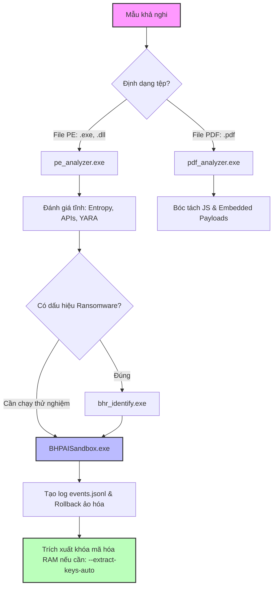

# BHPAI - Hướng Dẫn Sử Dụng

Tài liệu hướng dẫn sử dụng bộ công cụ bảo mật, phân tích mã độc và cứu hộ hệ thống **BHPAI**.

---

## Mục Lục
1. [Giới thiệu tổng quan](#1-giới-thiệu-tổng-quan)
2. [Cấu trúc thư mục & Thư viện phụ thuộc](#2-cấu-trúc-thư-mục--thư-viện-phụ-thuộc)
3. [Chính sách dùng thử 5 ngày (5-Day Trial) & Bản quyền](#3-chính-sách-dùng-thử-5-ngày-5-day-trial--bản-quyền)
4. [Hướng dẫn chi tiết từng công cụ](#4-hướng-dẫn-chi-tiết-từng-công-cụ)
   - [4.1. `pe_analyzer.exe` / `pe.exe` - Phân tích tĩnh file PE (EXE/DLL)](#41-pe_analyzerexe--peexe---phân-tích-tĩnh-file-pe-exedll)
   - [4.2. `pdf_analyzer.exe` - Phân tích tệp tài liệu PDF](#42-pdf_analyzerexe---phân-tích-tệp-tài-liệu-pdf)
   - [4.3. `BHPAISandbox.exe` - Sandbox phân tích động & Trích xuất khóa RAM](#43-bhpaisandboxexe---sandbox-phân-tích-động--trích-xuất-khóa-ram)
   - [4.4. `bhr_identify.exe` - Nhận diện & Đánh giá Ransomware](#44-bhr_identifyexe---nhận-diện--đánh-giá-ransomware)
   - [4.5. `bhpai_rescue.exe` - Cứu hộ ngoại tuyến WinRE](#45-bhpai_rescueexe---cứu-hộ-ngoại-tuyến-winre)
5. [Quy trình phân tích mẫu thực tế (Workflow)](#5-quy-trình-phân-tích-mẫu-thực-tế-workflow)

---

## 1. Giới thiệu tổng quan

Thư mục `release_bin` chứa các công cụ độc lập (standalone binaries) đã được biên dịch hoàn chỉnh từ C++, tối ưu hóa hiệu năng và được tích hợp các cơ chế bảo vệ, phân tích chuyên sâu gồm:
- **Tĩnh học (Static Analysis)**: Bóc tách cấu trúc PE Header, Opcode TF-IDF, giải mã ngược Capstone, sinh luật YARA, phân tích cây đối tượng PDF và mã JavaScript nhúng.
- **Động học (Dynamic Sandbox)**: Cách ly file nghi vấn qua cơ chế ảo hóa Overlay (Filesystem & Registry), giám sát hành vi nhân ETW và hỗ trợ Intel PT (Processor Trace).
- **Pháp y bộ nhớ (Memory Forensics)**: Quét và trích xuất khóa mã hóa đối xứng/bất đối xứng (AES/RSA) trực tiếp từ RAM hoặc tập tin phân trang `pagefile.sys`.
- **Cứu hộ ngoại tuyến (WinRE Rescue)**: Khắc phục sự cố mã độc khóa hệ điều hành với cơ chế bảo vệ giao dịch 5 pha (5-Phase Transaction).

---

## 2. Cấu trúc thư mục & Thư viện phụ thuộc

Tất cả các file thực thi trong thư mục này đều yêu cầu các thư viện DLL dùng chung đi kèm. **Không xóa hoặc di chuyển các DLL này ra khỏi thư mục `release_bin`**:

| Tên tập tin / Thư mục | Mô tả chức năng |
| :--- | :--- |
| **`pe_analyzer.exe`** (hoặc `pe.exe`) | Công cụ phân tích tĩnh file PE (EXE / DLL / SYS). |
| **`pdf_analyzer.exe`** | Công cụ phân tích cấu trúc, payload và rủi ro trong file PDF. |
| **`BHPAISandbox.exe`** | Sandbox phân tích động cho tiến trình 64-bit và điều phối tổng thể. |
| **`BHPAISandbox32.exe`** | Engine phụ trợ chạy sandbox cho các ứng dụng PE 32-bit. |
| **`bhr_identify.exe`** | Công cụ nhận diện hành vi Ransomware & hồ sơ mã hóa (BHR Profile). |
| **`bhpai_rescue.exe`** | Ứng dụng cứu hộ hệ thống độc lập trong môi trường WinRE / WinPE. |
| `BHPAIMonitor.dll` / `sysnethelper.dll` | Hooking & Giám sát API hành vi 64-bit trong Sandbox. |
| `sysnethelper32.dll` | Hooking & Giám sát API hành vi 32-bit trong Sandbox. |
| `libcapstone.dll` | Thư viện Capstone Engine phục vụ Disassembly. |
| `libcrypto-3-x64.dll`, `libssl-3-x64.dll` | Thư viện OpenSSL 3.0 mật mã học. |
| `zlib1.dll`, `libwinpthread-1.dll` | Thư viện giải nén stream PDF và đa luồng POSIX. |
| `license.dat` | Tập tin bản quyền số hóa bằng mật mã Ed25519 (chỉ cần sau khi hết thời gian dùng thử). |
| `Overlay/` | Thư mục lưu trữ ảo hóa tạm thời của Sandbox. |

---

## 3. Chính sách dùng thử 5 ngày (5-Day Trial) & Bản quyền

Hệ thống được thiết kế để bạn có thể **sử dụng ngay lập tức mà không cần bất kỳ cấu hình hay thao tác kích hoạt nào**:

### Chế độ dùng thử tự động 5 ngày (Mặc định)
- Ngay khi bạn chạy bất kỳ công cụ nào lần đầu tiên, hệ thống sẽ **tự động kích hoạt thời gian dùng thử 5 ngày (5-Day Trial)**.
- Trong suốt 5 ngày này, **tất cả tính năng cao cấp của mọi công cụ đều được mở khóa đầy đủ 100%**.
- Hệ thống tích hợp cơ chế chống tua ngược thời gian máy tính (Anti-rollback clock protection).
- Bạn không cần nhập key, không cần kết nối mạng hay kích hoạt file `license.dat` trong giai đoạn 5 ngày này.

### Sau khi kết thúc 5 ngày dùng thử
- Sau khi hết thời hạn 5 ngày dùng thử, các công cụ sẽ tự động kích hoạt lại yêu cầu bản quyền và cần file `license.dat` để tiếp tục hoạt động.
- Khi đó, bạn chỉ cần dùng công cụ `get_hwid.exe` có sẵn trong thư mục để lấy mã máy (tự động sao chép vào Clipboard) và yêu cầu cấp file `license.dat` đặt vào thư mục `release_bin`.

---

## 4. Hướng dẫn chi tiết từng công cụ

### 4.1. `pe_analyzer.exe` / `pe.exe` - Phân tích tĩnh file PE (EXE/DLL)
Công cụ phân tích cấu trúc mã nhị phân Windows không cần thực thi file.

**Tính năng sẵn có:**
- Trích xuất chi tiết PE Header (DOS, File, Optional Header, Data Directories, Sections).
- Tính độ hỗn loạn Entropy của từng section để phát hiện mã hóa/nén.
- Disassembly mã máy tại Entry Point bằng Capstone Disassembler.
- Trích xuất bảng Import/Export APIs, phát hiện các API nguy hiểm liên quan đến Crypto, Injection, Process Hollowing.
- Phân tích thống kê chuỗi (Strings Analysis) và TF-IDF Opcode.
- Tự động phát hiện các loại Packer phổ biến (UPX, FSG, WWPack).
- Tự động tạo luật nhận diện YARA (`<tên_file>.yar`) và xuất báo cáo JSON chuẩn (`<tên_file>.json`).

**Cú pháp:**
```powershell
.\pe_analyzer.exe <đường_dẫn_file_pe> [nhãn_label] [--safe-run]
```
*(Lưu ý: Bạn có thể sử dụng `pe.exe` như một tên gọi tắt tương đương).*

**Các tham số:**
- `<đường_dẫn_file_pe>`: Đường dẫn file `.exe`, `.dll`, hoặc `.sys` cần phân tích.
- `[nhãn_label]` *(tùy chọn)*: Gán nhãn cho tập tin (ví dụ: `malware`, `ransomware`, `benign` hoặc `unknown`). Mặc định: `unknown`.
- `--safe-run` *(tùy chọn)*: Bật chế độ chạy an toàn với giới hạn bộ nhớ phân tích.

**Ví dụ:**
```powershell
# Phân tích file mẫu và xuất báo cáo
.\pe_analyzer.exe C:\Samples\suspect.exe malware

# Phân tích nhanh bằng tên rút gọn
.\pe.exe test.dll benign --safe-run
```
*Kết quả:* Sẽ tạo ra file `suspect.exe.json` và `suspect.exe.yar` ngay tại thư mục chứa mẫu.

---

### 4.2. `pdf_analyzer.exe` - Phân tích tệp tài liệu PDF
Công cụ chuyên dụng giải mã và phân tích các tệp tin PDF độc hại theo chuẩn **Multi-Format Engine v2.0**.

**Tính năng sẵn có:**
- Phân tích cây đối tượng PDF (Object Tree Parser) với cơ chế bảo vệ ngân sách bộ nhớ (Analysis Budget).
- Phát hiện mã JavaScript ẩn bên trong đối tượng PDF, tính điểm mức độ obfuscation (làm rối), đếm số lần sử dụng hàm nguy hiểm (`eval`, `unescape`).
- Phát hiện các cơ chế tự kích hoạt: `/OpenAction`, `/AA`, `/Launch`, `/EmbeddedFiles`.
- Trích xuất tập tin nhúng (Embedded Executables / Payloads) ra thư mục chỉ định.
- Trích xuất và defang các chỉ số IOCs: Tên miền (Domains), địa chỉ IPv4, đường dẫn URL.
- Đánh giá tổng hợp điểm rủi ro (Contextual Threat Score 0-100) và ánh xạ kỹ thuật MITRE ATT&CK.

**Cú pháp:**
```powershell
.\pdf_analyzer.exe <đường_dẫn_file.pdf> [nhãn_label] [--json-out <file.json>] [--extract-payloads <thư_mục>]
```

**Các tham số:**
- `<đường_dẫn_file.pdf>`: Tệp PDF cần kiểm tra.
- `[nhãn_label]` *(tùy chọn)*: Gán nhãn mẫu (mặc định: `unknown`).
- `--json-out <file.json>`: Chỉ định đường dẫn lưu báo cáo JSON chuẩn Universal Schema 2.0 (mặc định lưu `<file>.pdf.json`).
- `--extract-payloads <thư_mục>`: Trích xuất toàn bộ các file đính kèm/payload ngầm ra thư mục chỉ định.

**Ví dụ:**
```powershell
# Kiểm tra file PDF và trích xuất payload nghi vấn vào thư mục C:\Dumps
.\pdf_analyzer.exe invoice.pdf malware --extract-payloads C:\Dumps --json-out report.json
```

---

### 4.3. `BHPAISandbox.exe` - Sandbox phân tích động & Trích xuất khóa RAM
Môi trường hộp cát an toàn kiểm soát thực thi mã độc, tự động hỗ trợ cả kiến trúc 32-bit và 64-bit.

**Tính năng sẵn có:**
- **Thực thi cách ly**: Sử dụng cơ chế phân hướng Overlay cho tập tin và Registry. Mã độc ghi file hoặc sửa Registry sẽ chỉ tác động trong vùng nhớ ảo và tự động bị hủy bỏ (Rollback) sau phiên làm việc.
- **Hooking toàn diện**: Tự động inject `sysnethelper.dll` / `BHPAIMonitor.dll` để theo dõi API Filesystem, Process, Thread, Network, Memory, Crypto.
- **Giám sát hạt nhân ETW**: Lắng nghe sự kiện nhân Windows để phát hiện hành vi phá hủy như xóa Shadow Copy, sửa Bootloader, ép BSOD.
- **Watchdog bảo vệ**: Tự động ngắt tiến trình độc hại nếu phát hiện hành vi hủy hoại màn hình hoặc gọi `NtRaiseHardError`.
- **Trích xuất khóa mã hóa (Forensics RAM Key Extractor)**: Tìm kiếm các cấu trúc khóa đối xứng AES-128, AES-256, RSA trong bộ nhớ RAM hoặc file phân trang `pagefile.sys`.

**Cú pháp sử dụng:**

#### A. Chạy phân tích động file PE:
```powershell
.\BHPAISandbox.exe <đường_dẫn_file_pe>
```
*Hệ thống sẽ tự nhận diện 32-bit / 64-bit, kích hoạt container overlay, hook API, ghi log sự kiện ra `events.jsonl` và xuất báo cáo phân tích hành vi.*

#### B. Trích xuất khóa giải mã Ransomware từ RAM / Pagefile / Dump:
1. **Tự động quét toàn bộ bộ nhớ và file pagefile.sys:**
   ```powershell
   .\BHPAISandbox.exe --extract-keys-auto
   ```
2. **Quét bộ nhớ của một tiến trình cụ thể theo PID:**
   ```powershell
   .\BHPAISandbox.exe --extract-keys-pid <PID>
   ```
3. **Quét tìm khóa từ file Crash Dump (.dmp):**
   ```powershell
   .\BHPAISandbox.exe --extract-keys-dump <đường_dẫn_file.dmp>
   ```
4. **Quét tìm khóa từ file bộ nhớ ảo (Pagefile):**
   ```powershell
   .\BHPAISandbox.exe --extract-keys-pagefile C:\pagefile.sys
   ```
5. **Kiểm tra phần cứng có hỗ trợ Intel PT không:**
   ```powershell
   .\BHPAISandbox.exe --check-intel-pt
   ```

---

### 4.4. `bhr_identify.exe` - Nhận diện & Đánh giá Ransomware
Bộ công cụ chuyên sâu phát hiện và phân loại họ Ransomware dựa trên hệ thống 10 trụ cột đặc trưng.

**Tính năng sẵn có:**
- Đánh giá phân tích 10 trụ cột: Cấu trúc PE, Entropy, API mã hóa, Từ khóa tiền chuộc (Ransom note keywords), Mật độ opcode số học/quay/dịch (ARX Density), Đồ thị luồng điều khiển CFG, Nhận diện bộ nén Packer, Đồ thị hành vi (Behavior Graph).
- Lập thẻ hồ sơ mật mã **BHR CRYPTO PROFILE CARD**: Dự đoán thuật toán mã hóa (AES, ChaCha, RSA), chế độ hoạt động (CBC, GCM), cơ chế lưu trữ và tạo IV/Key, kiểm tra hành vi ghi đè hàng loạt (Mass Encrypt).
- Tích hợp liên kết với kết quả chạy từ Sandbox.

**Cú pháp:**
```powershell
.\bhr_identify.exe <đường_dẫn_file_pe> [tùy chọn]
```

**Các tham số:**
- `<đường_dẫn_file_pe>`: Tệp thực thi cần thẩm định.
- `--sandbox` hoặc `--run-sandbox`: Tự động gọi sandbox phân tích động cùng lúc.
- `--sandbox-json <log.json>`: Ghép dữ liệu log hành vi có sẵn từ sandbox vào để tính toán lại điểm nguy cơ.
- `--json`: Xuất toàn bộ kết quả phân tích dưới dạng cấu trúc JSON chi tiết.

**Ví dụ:**
```powershell
# Phân tích tĩnh nhận diện Ransomware
.\bhr_identify.exe C:\Malware\lockbit.exe

# Phân tích kết hợp log động và xuất JSON
.\bhr_identify.exe C:\Malware\sample.exe --sandbox-json events.jsonl --json
```

---

### 4.5. `bhpai_rescue.exe` - Cứu hộ ngoại tuyến WinRE
Công cụ cứu hộ chuyên nghiệp được thiết kế để chạy trong môi trường **Windows Recovery Environment (WinRE)** hoặc Windows PE khi máy tính bị nhiễm Ransomware nghiêm trọng không thể khởi động bình thường.

**Tính năng sẵn có:**
- Chạy độc lập 100% Offline (Air-gapped), không phụ thuộc vào kết nối mạng hay dịch vụ của Windows đang hoạt động.
- Trích xuất và phân tích ngoại tuyến Offline Registry (`SYSTEM`, `SOFTWARE`, `SAM`).
- Quét tìm cơ chế duy trì mã độc (Persistence items: Run Keys, Scheduled Tasks, Winlogon Helper, Services, Drivers).
- Quét phát hiện luồng dữ liệu ẩn NTFS Alternate Data Streams (ADS).
- **Cơ chế giao dịch 5 pha an toàn (5-Phase Transaction Journal)**:
  1. *Detect (Phát hiện)*: Quét xác định toàn bộ thành phần nguy hại.
  2. *Backup (Sao lưu)*: Sao lưu nguyên trạng các file và registry key bị nhiễm vào thư mục an toàn `BHPAI_Rescue_Backup`.
  3. *Modify (Chỉnh sửa)*: Vô hiệu hóa, cách ly mã độc và sửa khóa Registry.
  4. *Verify (Xác minh)*: Kiểm tra tính toàn vẹn hệ thống sau chỉnh sửa.
  5. *Commit (Xác nhận)*: Ghi nhận giao dịch hoàn tất thành công.
- Hỗ trợ Rollback hoàn tác mọi thay đổi nếu cần thiết.

**Cú pháp:**
```powershell
.\bhpai_rescue.exe [các_tùy_chọn]
```

**Bảng tham số cốt lõi:**
| Tham số | Ý nghĩa & Hành vi |
| :--- | :--- |
| `--target <Ổ_đĩa>` | Chỉ định ổ đĩa cài đặt Windows bị ảnh hưởng (ví dụ: `--target D:` hoặc `--target C:`). |
| `--dry-run` | **Chế độ mô phỏng an toàn**: Chỉ quét và hiển thị các hành động dự kiến thực hiện, **TUYỆT ĐỐI KHÔNG** chỉnh sửa hay xóa bất cứ file nào. |
| `--repair` | Cho phép thực hiện sửa chữa thật sự thông qua quy trình giao dịch 5 pha có sao lưu. |
| `--rollback` | Hoàn tác toàn bộ thay đổi của phiên cứu hộ gần nhất từ thư mục `BHPAI_Rescue_Backup`. |
| `--auto` hoặc `-y` | Chạy chế độ tự động không cần người dùng can thiệp từng bước (mặc định vẫn là dry-run trừ khi truyền kèm `--repair`). |
| `--full-scan` | Quét sâu toàn bộ thư mục người dùng: Desktop, Downloads, Documents, Scheduled Tasks, Drivers, ADS. |
| `--report <đường_dẫn>`| Tùy chỉnh đường dẫn lưu báo cáo cứu hộ. |
| `--json` | Xuất kết quả phiên làm việc dưới dạng JSON có cấu trúc. |
| `--help` hoặc `-h` | Hiển thị bảng trợ giúp. |

**Ví dụ thực tế trong WinRE:**
```powershell
# 1. Quét kiểm tra thử (Mô phỏng an toàn, không ghi đè dữ liệu)
.\bhpai_rescue.exe --target D: --dry-run --full-scan

# 2. Tiến hành sửa chữa và làm sạch hệ thống tự động
.\bhpai_rescue.exe --target D: --repair --auto --full-scan

# 3. Nếu muốn hoàn tác lại trạng thái ban đầu trước khi sửa:
.\bhpai_rescue.exe --target D: --rollback
```

---

## 5. Quy trình phân tích mẫu thực tế (Workflow)

Khi bạn nhận được một file khả nghi (ví dụ: `sample.exe` hoặc `document.pdf`), hãy thực hiện theo trình tự khuyến nghị sau:



1. **Bước 1 - Phân tích tĩnh ban đầu**:
   - Dùng `pe_analyzer.exe sample.exe` để xem cấu trúc, entropy, các chuỗi nhạy cảm và tạo rule YARA.
   - Nếu là tài liệu, dùng `pdf_analyzer.exe sample.pdf --extract-payloads .\extracted` để bóc tách tệp độc hại ngầm.
2. **Bước 2 - Nhận diện Ransomware**:
   - Chạy `bhr_identify.exe sample.exe` để xem điểm đe dọa (Threat Score) và thẻ hồ sơ mã hóa Crypto Profile.
3. **Bước 3 - Kiểm tra hành vi trong Sandbox**:
   - Khởi chạy mẫu với `BHPAISandbox.exe sample.exe`.
   - Quan sát API hook và log hoạt động được bảo vệ trong container overlay mà không sợ lây nhiễm vào máy thật.
4. **Bước 4 - Trích xuất khóa khẩn cấp (Forensics)**:
   - Nếu máy tính đã bị ransomware mã hóa file, chạy ngay lệnh:
     ```powershell
     .\BHPAISandbox.exe --extract-keys-auto
     ```
     để cứu vãn các khóa AES/RSA còn sót lại trong RAM và file pagefile trước khi tắt máy.
5. **Bước 5 - Cứu hộ hệ thống bị sập (Rescue)**:
   - Khởi động vào WinRE và sử dụng `bhpai_rescue.exe` để loại bỏ mã độc khỏi ổ đĩa Windows ngoại tuyến.

---

> **Lưu ý an toàn:** Mặc dù Sandbox và các công cụ phân tích tĩnh đã được trang bị cơ chế bảo vệ tối đa, việc thao tác với mã độc thực tế (live malware) nên được thực hiện trên máy ảo chuyên dụng cách ly mạng (Host-Only / Air-gapped VM).
